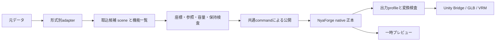

# モデル取込・情報保持・保存・出力仕様

版: 1 / 2026-09-12。ユーザー依頼「ここで一つ仕様をまとめてドキュメント化」に対応。

本書は[設計v2](NyaForge-Authoring-Design2.md)第5・11・12節を具体化する取込/交換領域の仕様。製品目標、Windows先行、C0〜C5の範囲は変更しない。本書の「実装要件」はこれから満たす契約で、実装済みという意味ではない。進捗と証拠は[current_task](../current_task.md)、実素材の観測値は[取込調査](Real-Asset-Import-Plan.md)を正本とする。

## 1. 採用する方針

1. 制作の正本は `AuthoringDocument` が所有するgraphと編集asset。GLBやUnity Sceneを第二の制作正本にしない。
2. GLB/VRMは交換・取込/出力の形式として使う。GLBだけを制作履歴や他アプリ固有設定の完全な保存先としない。
3. 元FBX/BLEND/Unity projectは変更しない。変換結果は別の派生ファイル。原本の保管と、NyaForgeで編集可能に保持できたことは別に判定する。
4. 未対応属性、骨、weight、morphを黙って削らない。「取込成功」は指定した対象・機能の契約を満たしたことを示す。
5. Blenderなしで新規制作→native保存→標準出力できる設計を維持する。今回のBlender調査スクリプトは開発用の読取ツール。FBX初期経路は設計v2のUnity Bridgeを基準とし、Blender変換は任意の検証/互換adapterに限定する。
6. importer/exporter、数値変換、制作モデル、保存、GUI/MCPの責務を分ける。表示できたことを編集可能・保存可能・再出力可能と読み替えない。

## 2. GLBの容量とアプリの対応を分ける

GLBはglTFのJSON/バイナリをまとめる形式。複数mesh、node階層、skin、morph、材質/画像、animationを表現できる。4weightを超える情報も追加の `JOINTS_n` / `WEIGHTS_n` セットに格納できる。現在のNyaForgeの1mesh・256骨・4weight・256morphという上限はGLB形式の上限ではない。[glTF仕様: GLB](https://registry.khronos.org/glTF/specs/2.0/glTF-2.0.html#glb-file-format-specification)、[skin属性](https://registry.khronos.org/glTF/specs/2.0/glTF-2.0.html#skinned-mesh-attributes)

Blenderのmodifier/constraint/node graphやUnityのcomponent・任意shaderの編集データについて、本製品は標準GLBに同じ意味で保持できると約束しない。形状/画像へ焼き込んだ結果と元の編集手順は別物。VRMのhumanoid・expression・Springも標準GLBのskinだけでは代替できず、専用adapterとmetadataが必要。

### 形式ごとの責務

| 形式・場所 | 責務 | 自動的には保証しないこと |
|---|---|---|
| 元FBX / BLEND / Unity project | 入力の原本、元アプリでの再編集 | NyaForgeでの全機能編集、異形式への完全変換 |
| GLB / VRM | 対応情報の交換と検証可能な取込 | 元アプリの全設定、NyaForgeのgraph/layer/履歴 |
| NyaForge native | 取り込んだ編集asset、graph、対応metadataの保存 | 未実装属性の保持、元FBX/BLENDのバイト同一再生成 |
| Bake DTO + Unity Bridge | 標準のUnity出力と管理対象の更新 | 利用者がUnity側へ追加した設定の削除/置換 |
| private原本・調査結果 | ローカル検証と出所の記録 | public repoへの素材同梱 |

## 3. 情報保持の判定

実装要件: 読み取った各機能へ対象範囲と下記の判定を付ける。属性ごとの判定と `viewable / editable / rigEditable / exportable` 能力を混同しない。

| 判定 | 意味 | 必要な証拠 |
|---|---|---|
| 編集可能 | nativeの型として保持し、編集・保存/Openできる | identity、値、依存参照の往復と操作回帰 |
| 保管のみ | payloadと必要資源を保持するが、意味を解釈して編集しない | bytes/hashと依存一式の往復。原本pathだけならこの判定にしない |
| 変換済み | 対応する表現へ変換/焼込みした | 変換規則・変換元/先対応表・差分測定。元の編集能力の有無も明記 |
| 未対応 | 正しく読み取る/保持する経路がない | 対象と理由を列挙し、その範囲を含む完全取込は拒否 |
| 情報なし | 元入力に存在しない | 未対応や値0と区別。推測値で埋めない |

未知の必須glTF拡張は取込を拒否する。未知の任意拡張を保管する場合も、JSONだけでなく参照buffer/image等と元index対応を含める。topologyやnodeを編集して参照が無効になったpayloadは再出力可能と表示しない。保持できない場合は未対応として報告し、原本へのリンクだけで「保持済み」にしない。

部分取込は対象meshや情報を明示選択した別の操作とする。初期値は読み捨てのない取込。上位4weight化、骨削除、morph削減、mesh結合、modifier焼込みは独立した操作/出力profileにし、変更量を表示する。無条件の確認ダイアログは増やさず、損失を伴う変更の選択を利用者に見える操作へ置く。

## 4. モジュールとデータの流れ

以下は責務の契約であり、新型の名前/全APIが実装済みという意味ではない。

| モジュール | 担当すること | 担当しないこと |
|---|---|---|
| 形式adapter | GLB/VRM/Bridge DTOのdecode、入力機能一覧、source locator生成 | 文書公開、Unity表示、履歴操作 |
| source scene候補 | node/mesh instance/skin/morph/material/画像/拡張の参照付き不変データ | GUI状態、永続的なライブラリ内部形式 |
| source変換 | TRS/matrix、親合成、inverse-bind、座標/単位変換 | weight削減、名称推測による骨対応 |
| import planner/validator | 対応能力・予算・参照検査、制作assetと対応表の候補 | 現在文書の先行変更 |
| publish coordinator | 検査済みgraph/metadata/projectionを共通command経路へ公開 | importer内での独自Undoや保存 |
| native codec/store | version付きasset、対応表、metadataの一括保存 | GLBの再生成によるnative保存代用 |
| export profile | rest形状・skin・morph・材質とmetadataの出力、変換差分 | 一時的な揺れposeの通常skin出力への混入 |
| GUI / MCP | 同じserviceの操作窓口、能力/失敗/進行表示 | 各窓口での第二の変換・検査実装 |

現行の `ImportedSourceHierarchy / ImportedRigSession / ImportedPreviewRig / Vrm0SpringRuntime / IVrmSpringPreview` は対応profileの実装として再利用する。一般affineへ拡張する際、原点だけを完全なnode transformと呼び替えない。

## 5. 情報別の実装契約

### 座標・骨格

- source local、source world、mesh rest、bone bind、posed avatarを区別し、座標系/単位を各境界に記録する。
- nodeのTRS/matrixと合成順を統一し、一般inverse-bindを保持する。source node原点とinverse-bind由来Headを同一視しない。
- skinの頂点は関節行列とinverse-bindの組合せで評価する。mesh nodeのtransformを静的meshと同じように二重適用しない。
- normalは必要な逆転置変換、tangentは基底とhandedness、鏡映は面向きを扱う。morphのPOSITION deltaには平行移動を加えない。
- 特異行列・非有限値・不正階層は拒否。非一様scale/shearに対するmesh変換の対応と、Spring球/capsuleの対応可否は独立に返す。
- node親子関係・元children順・非joint nodeは維持。VRM0/1の座標規約や末端設定を混ぜない。

### 複数mesh・identity

- 取込候補は複数meshとmesh instanceを表現する。制作側も複数objectを保持し、`object.select`でactive objectを明示する。旧形式の1object documentは同じ意味で読める。Workbenchではactive objectを編集し、他objectを読み取り専用で同時表示できる。結合出力は別の完了条件とする。
- sourceHashに加えnode/mesh/primitive/skin/target indexのlocatorを持つ。名前は表示用でidentityにしない。異なるmeshの同名morphは独立target。
- 一つのmeshを複数nodeが参照する場合、共有assetとinstance変換を区別する。同じskeletonを使うmeshもskin/bindの差を保持する。
- 頂点の分割・並べ替え・結合には明示的な対応表が必要。元indexをUnityの表示頂点indexと同一視しない。
- 再取込でsourceHashが変わった場合、既存IDへの対応は別途検証する。名前一致や新hashからのID再生成をそのまま既存assetの更新成功としない。
- I04-Bはimporterだけでなく、単一objectを前提とする選択・評価・保存・pose・GUI/MCP・出力を監査する。native documentは複数objectとactive objectを保持し、既存1object作品のschema/hash互換を保つ。Workbenchはactive objectを編集対象、非active objectを読み取り専用の確認用backdropとして扱う。

### weight・morph・材質・animation

- 全 `JOINTS_n / WEIGHTS_n` セット、正規化表現、非ゼロ影響を検査して保持する。重複joint/負値/非有限値は診断し、正規化時の差を測る。
- morphはmeshごとのtarget順/名前/identityと初期weightを保持する。POSITION/NORMAL/TANGENT対応を別に記録し、一部だけ読めたことを全target保持としない。
- 材質slot、primitiveへの割当、texture参照、UV set、sampler、alpha等を対応表で保持する。NyaForge内部に材質機能があっても、外部材質importが完成した証拠にはならない。
- glTF animationとVRM表情/揺れ設定は別の機能。animation未実装時は存在を報告し、現在poseで代用しない。
- 既知のVRM拡張でも内部フィールドごとに能力を判定する。metaの利用条件/permissions、lookAt、firstPerson、expressionの材質/texture binding・制御flag等も在庫に含める。拡張名を認識しただけで全情報保持と表示しない。未保持・未解決の意味情報がある場合は完全VRM出力を拒否し、勝手に既定値や許諾条件を作らない。
- Unity/VRChat固有component、shader、設定はBridge側の所有境界へ残す。FBXから失われたVRM metadataを骨名だけで復元しない。

## 6. native保存と出力

実装済み基盤: manifest schema 4でgraphとexpression/Spring/rig/PhysBones target/共通secondary-motionの型付きattachmentを一括公開。共通payloadは `secondary-motion.nyaforge.bin` の `NYSM` v1で、VRM0 source-node subtreeはstable BoneIdへ移行して保存する。rig payload v3は全source階層を保存し、旧v1/v2の階層不明を維持する。これは未知拡張の汎用保管が完成したという意味ではない。

実装要件: 新しいscene/affine/大容量assetにはversion付きcodecと移行を付ける。writerだけでなくreader、hash、予算、GUI/MCP、exportへの影響を同じ変更単位で記録する。汎用payloadを既存の型付きattachmentへ無理に混ぜず、新しいtarget設定は専用schemaと名前を持たせる。

取り込んだ対応データの再Openは元ファイルやBlenderに依存させない。再取込/元アプリへの参照操作にだけ原本を必要とする。原本の移動・欠落はnative内の編集assetを消す理由にしない。未知データの保管方式はschema設計時に決め、実装前は未対応と表示する。

出力はprofileごとに対象機能・予算・変換を示す。通常skin出力はrest形状＋bind＋skin/morph。一時Spring姿勢や撮影poseを焼き込むstatic出力は別profile。Unity再出力は既存GUID/管理資源対応を使い、利用者のcomponentを無言で消さない。

## 7. 検証仕様

取込前→変換後→native Save/Open→再出力→受取側を分けて記録する。各段階で件数一致だけでなく意味を比較する。

| 対象 | 比較項目 |
|---|---|
| 出所 | source SHA256、converter/adapter version、設定、入力/派生ファイルの識別 |
| 構成 | 全node/mesh instance/primitive/skin/slot、親子/順序、参照先、mapping |
| mesh | bind/rest形状、複数poseの変形、normal/tangent、UV/面向き、bounds |
| skin/morph | 全非ゼロweightとjoint対応、targetごとのdelta/初期weight、独立target操作 |
| VRM意味情報 | meta/利用条件、humanoid、lookAt/firstPerson、expressionの各binding/flag、Springの値と参照の往復。未解決を残す完全VRM出力は不可 |
| 保存 | asset/hashとmetadata、原本を参照しないOpen、旧形式移行、不明値の維持 |
| 失敗 | 不正入力・予算超過・IO失敗・取消で文書/metadata/dirty/Undo/表示を保持、再試行 |
| Windows/受取側 | 実入力の表示・選択・pose・Save/Open、DPI/文字欠け、出力後の変形と設定 |

数値検証の初期目標はメートル換算rest位置誤差1e-5、posed位置誤差1e-4、weight絶対差1e-6。方向は正規化して角度差を比較し、ゼロ長を成功扱いにしない。これは今後の基準で、実素材で測定済みの値ではない。fixtureは最大誤差を報告し、対象の桁/scaleで基準が成立しなければ理由を記録して仕様を更新する。

公開回帰は自作fixture。実素材名・原本・派生モデル・詳細調査はprivate/追跡除外へ。テスト成功、Player handler成功、実クリック/見た目受入、受取側合格はそれぞれ別の証拠。

## 8. 現在地点と実装順

コード照合対象は現行main。GLB importは一回の制作操作で一つの明示候補をgraph objectとして公開し、一般affine（node TRS/matrix・inverse-bind）、4weight、256骨/256morphの範囲で扱う。WEIGHTSのfloat形式に加え、normalized UBYTE/USHORTはfloatへ復元してから同じbinding検証へ通す。sparse accessorは引き続き未対応として拒否する。`GlbSceneInventoryReader`は複数mesh/instance/skinを元indexで保持し、Workbenchはnode instance indexを指定した場合にそのnodeのmesh／skin対応を採用する。skinを持たないnode instanceは静的meshとして扱い、GLB全体に別skinがあることだけを理由にskinned importへ回さない。native documentは最大64 objectのactive object方式で、`object.select`とSave/Openを提供する。 skinned objectのsource rig sessionはGraphIdで分離した`imported-rig-sessions.nyaforge.bin`へ保存し、active object切替時に対応sessionを選ぶ。取込source nodeは最大4096、一時実行骨は最大256。複数objectは`multi-object.nyaforge-bake.json`配下へobjectごとのBakeを束ねて出力できるが、mesh結合・共有参照・複数SkinDeform同時評価は未実装。nativeの材質/rig機能が進んでいても、任意の外部モデルを完全に取り込める段階ではない。 rig/morphを含むgraphの出力は`project.nyaforge.json` native packageへルーティングし、Skin/Morph情報を保持したまま再開できる。標準VRM/GLBへのskin/morph変換は別の未完了profileである。

現行readerには本仕様をまだ満たさない箇所もある。`GlbImport`は材質・静的scene構造・NORMAL/TANGENT morphを保持せず警告し、追加UV等も全属性を取り込まない。`GlbSceneInventoryReader`は複数mesh/instance/skinの参照とnode world transformを候補化し、`GlbImporter.Read(bytes, meshIndex)` / `GlbSkinImporter.Read(bytes, meshIndex, skinIndex)` / `GlbSourceSkinImporter.Read(bytes, meshIndex, skinIndex)` とWorkbenchの選択GUIは選択した候補を一つずつnative objectへ公開できる。16bit JOINTSはbyte幅を保って読取り、source skin表示は最終graph出力へ適用して下流編集を保持する。Workbenchのactive object編集と非active object同時表示は実装済みだが、結合出力、同名morph/共有参照、複数SkinDeformの同時評価は未実装。未知の `extensionsRequired` を網羅して拒否する処理、任意のVRM meta/利用条件/未知拡張を依存込みで保管する機構も未実装。これらはI04-B/Eの解消対象で、現在の取込成功を本仕様の完全保持成功と称しない。容量監査には16MiB/blob・100,000頂点・32submesh等の予算も含める。

T03の読取調査は完了。実素材要求には20mesh、257骨、18weight/頂点、単一mesh262morphがあり、一般基底も必要。[観測条件と限界](Real-Asset-Import-Plan.md)を参照。これらは最低限の検証入力であり、新しい一律上限値そのものではない。

| 順 / ID | 次の成果物・完了条件 |
|---|---|
| 1 / I04-A | source affine数値モジュールと単体回帰。現行translation経路を維持し、一般node/IBM/方向変換を検証。新情報のnative移行設計を同梱 |
| 2 / I04-B | `GlbSceneInventoryReader`で複数mesh/instance/skinの候補とsource mappingを保持し、active object方式で候補を複数制作対象へ公開、選択・保存/Openを検証済み。次は同時表示・結合出力、同名target・共有参照・複数SkinDeformの同時評価を検証 |
| 3 / I04-C | 257骨/18weight/262target以上を保持する容量・codec・hash・表示/出力契約。固定予算とbyte/メモリ予算を一緒に決め、削減なしの往復と超過診断を検証 |
| 4 / I04-D | FBXの標準Bridge入力経路と能力表示。任意Blender adapterは別モジュール。変換前後比較、取消、依存未導入時の診断、原本保護を検証 |
| 5 / I04-E | 取込機能report、材質/animation/VRM意味情報/未知拡張の保持契約とGUI/MCP。既知拡張の未対応内部フィールドも含め、未対応を完全成功としない。opaque保持は依存資源・index失効も検証 |
| 6 / T05 + T04 | 実素材で取込・編集・保存/Open・出力を受入。必要profileの受取側確認、文字/DPI、frame時間・GC/メモリを記録 |

I04-Eのreport設計はAと同時に進め、完全取込の公開にはA〜Eの必要範囲が揃うことを条件とする。次の実装はI04-A。FBX runtimeライブラリの最終選定、未知payloadの永続化schema、最終容量値は各作業で根拠を伴って決める。これらの未決を理由にsource affine実装を待たせない。

本仕様を満たしても、C2〜C5の全身制作・品質向上・ターゲット互換の完成とはしない。[開発計画](Development-Plan.md)の全範囲を維持する。

## 標準GLB出力プロファイル（2026-09-13）

`GlbExportService` はnative制作データを変更せず、明示的な2 profileで標準glTF 2.0 GLBを生成する。

GLB/VRMの入出力にはnative blobと分離した128 MiBファイル予算と、1 mesh 200,000頂点の共通予算を適用する。native graph/blobの16 MiB予算を広げる変更ではない。予算超過は出力先を作成せず診断する。

| profile | 保持する情報 | 境界 |
|---|---|---|
| `StaticGeometry` | 現在評価できる表示メッシュ、頂点属性、正の一様変換 | skin・骨・morph・材質・アニメーションは含めず、複数submeshは現時点で一つのprimitiveへ結合 |
| `SkinnedGeometry` | 単一graphのsource mesh、4 influence weight、骨階層、inverse bind、POSITION morph | rest pose・identity source/output transformに限定。EditMeshによるトポロジー不変の頂点編集を保持する。任意pose、非ゼロmorph変形、未対応nodeは拒否しnative/static exportを案内 |

GUIには「標準GLB（表示形状）」と「標準GLB（skin/morph保持）」を分けて表示する。出力先は`<project>/exports/glb-*`の新規ディレクトリに限定し、失敗時はstagingを削除して既存制作状態を変更しない。標準GLBの読込確認はCore importerで行い、Unity・VRChat実機での外観／挙動受入とは分離して記録する。
