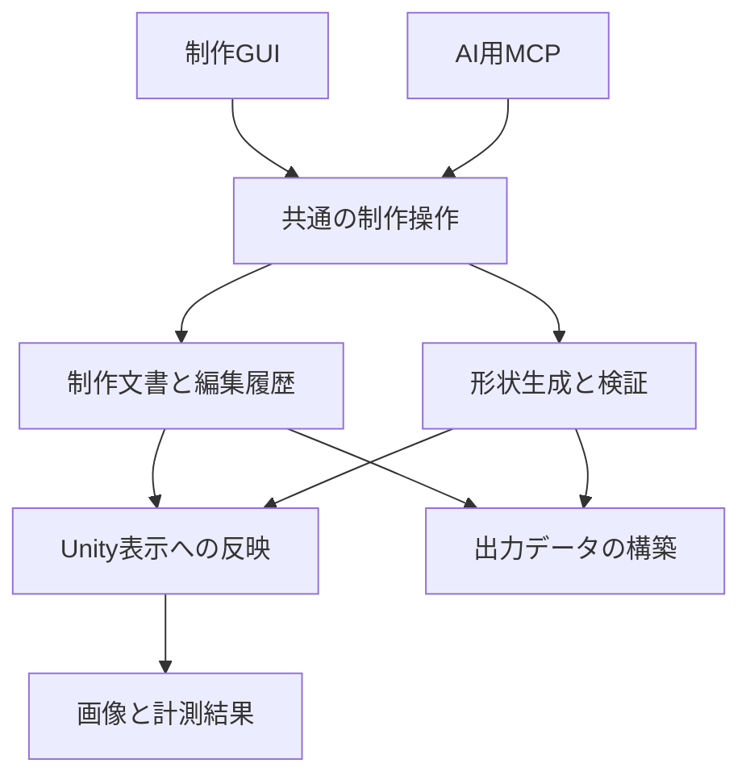

# Nya Ekaki 3D 制作アプリ拡張設計 v1

製品名は **Nya Ekaki 3D**。`NyaForge` は既存のコード・パッケージ・namespaceに残る旧開発名です。

> 旧設計・参考資料（2026-09-11）: 製品範囲と実装順は [設計v2](NyaForge-Authoring-Design2.md) に置き換えた。本文のNF-0／NF-1等は旧段階名であり、新規開発の順序には使わない。以前の判断を追えるよう本文を保持する。現在の実装は [current_task.md](../current_task.md)、操作は [使い方](Authoring-Quickstart.md) を参照。

作成日：2026-09-11  
対象：[moe-charm/NyaEkaki3D](https://github.com/moe-charm/NyaEkaki3D) / `main`
確認コミット：`6e1e4fc6d4c88b1b5f3368f3706bcec21a0a9e36`  
状態：実装前の設計提案。固定コミットのソースを静的確認した。Unityでのビルド・実行、実モデルでの計測、各出力ライブラリの実証は未実施。

## 1. 採用する方向

NyaForgeを、**人間とAIが同じ制作操作を使える、VR向け衣装・小物の制作／調整アプリ**に拡張する。既存ビューワーのパック読み込み、描画、ポーズ再生、確認セット、更新・復旧を活かす。

制作の正本は、元データへの固定参照、生成レシピ、編集レイヤー、材質、装着設定からなる `AuthoringDocument` と、その文書が参照する不変のバイナリデータとする。UnityのSceneやMeshは、その正本から再構築する表示結果である。

初回の完成条件は、**素体を表示し、小物を生成または既存小物を編集し、画像と数値で確かめ、保存・再読込・Undoを経て、別のUnityプロジェクトで同じ小物を利用できること**。

高機能な自動フィット、スカルプト、任意トポロジー編集、服全体の自動制作は後段にする。最初からチョーカー専用のデータ構造にはせず、生成物と既存メッシュを同じ編集・検証・出力経路に載せる。

## 2. 現在の実装と設計への影響

| 確認した実装 | そのまま活かせる部分 | 制作機能の追加で必要な変更 |
|---|---|---|
| `PackStore.Verify` | パック・bundleのサイズ、hash、互換tokenの検査 | 編集元データのidentityとCPU可読性の確認を追加 |
| `RendererBindings.Resolve` | 明示的なrendererId。名前・頂点数から同一物と推測しない | mesh identity、頂点対応、骨IDを別に持つ |
| `SessionDocument` | 表示、モーフ、ポーズ、カメラ、確認セット | 制作文書を別に置く。制作Undoへカメラ操作を混ぜない |
| `ViewerApp.Edit` | clone→validation→適用という入口 | 型付きcommand、revision、全体rollback、個別結果へ拡張 |
| `AvatarInstance` | prefab instanceとポーズ・モーフ評価 | 編集するmesh／materialの所有コピーと生成物の寿命管理 |
| `ViewerApp.Reload` | 旧版復元、Recovery状態、ロード要求の整理 | 制作正本をパック解放より長生きさせ、再bindする |
| `ViewerApp.VisualChecks` | PNG・session・metricsの組、同じカメラでの比較 | 汎用撮影serviceへ抽出、snapshot IDと制作物を対象に追加 |
| `JsonFiles` | 厳密なJSON、hash付き保存、一時ファイルからの置換 | 新形式用codecとbinary blob。巨大配列や多態型を押し込まない |

根拠：[PackStore](https://github.com/moe-charm/NyaEkaki3D/blob/6e1e4fc6d4c88b1b5f3368f3706bcec21a0a9e36/Assets/Viewer/Runtime/PackStore.cs)、[RendererBindings](https://github.com/moe-charm/NyaEkaki3D/blob/6e1e4fc6d4c88b1b5f3368f3706bcec21a0a9e36/Assets/Viewer/Contracts/RendererBindings.cs)、[Models](https://github.com/moe-charm/NyaEkaki3D/blob/6e1e4fc6d4c88b1b5f3368f3706bcec21a0a9e36/Assets/Viewer/Contracts/Models.cs)、[ViewerApp](https://github.com/moe-charm/NyaEkaki3D/blob/6e1e4fc6d4c88b1b5f3368f3706bcec21a0a9e36/Assets/Viewer/Runtime/ViewerApp.cs)、[AvatarInstance](https://github.com/moe-charm/NyaEkaki3D/blob/6e1e4fc6d4c88b1b5f3368f3706bcec21a0a9e36/Assets/Viewer/Runtime/AvatarInstance.cs)。

先に対応する論点は次の6つ。

1. `ViewerApp.Edit` は表示への `Apply` が途中失敗すると、文書が旧状態でもSceneの一部が変更され得る。制作commandでは候補を別に構築してから確定する。
2. `AvatarInstance` はGameObjectを複製するが、編集用meshを個別に所有する仕組みはない。pack由来の `sharedMesh`／`sharedMaterials` へ書き込まない。
3. `AvatarInstance.Apply` はTransformを戻してポーズを評価する。Sceneだけへ書き込んだ変更は消え得る。診断表示の解除先も「現在の制作材質」にする。
4. リロード時に既存instanceとbundleが解放される。制作状態を `ActivePack` やSceneの中だけに保存しない。
5. フレーミングやUIがmanifestのrenderer一覧に依存する。生成物をSceneに追加するだけでは確認対象から漏れる。
6. neckカメラには特定素体の高さに基づく固定値がある。骨・ランドマーク・対象範囲から求める汎用方式へ置き換える。

現在の視覚検査は `Renderer.bounds` を保守的な描画範囲として扱い、実頂点から求めた寸法とは区別している。scale100の衣装で `BakeMesh(false)` と `TransformPoint` の組が期待する結果にならなかったこともコードに記録されている。**このboundsを首周り測定や貫通判定へ転用しない。** [VisualChecks](https://github.com/moe-charm/NyaEkaki3D/blob/6e1e4fc6d4c88b1b5f3368f3706bcec21a0a9e36/Assets/Viewer/Runtime/ViewerApp.VisualChecks.cs)

## 3. 機能の境界

| 段階 | 提供するもの | 完了を判定する実例 |
|---|---|---|
| 最初の成立 | パック表示、制作保存、Undo、選択、既存メッシュの頂点移動、基本チョーカー生成、剛体装着、撮影・計測、Unityへの受け渡し | GUIとAIで同じ寸法へ変更し、再起動と受け渡し後も再現 |
| 小物制作の拡充 | リボン生成、断面・曲線調整、材質／テクスチャ設定、ミラー、滑らかな局所変形 | チョーカー＋リボンを複数サイズで制作 |
| 衣装調整 | 保護領域つきフィット、ウェイト転送、モーフ補正、複数ポーズ検査 | 肩・肘を含む衣装を調整し、既定ポーズで検査 |
| 以降の拡張 | UV編集、一般的なトポロジー編集、スカルプト、布のシミュレーション | 個別の必要性と品質基準が決まった機能から追加 |

最初のチョーカーは、首の近くへ配置し、寸法を調整して首ボーンへ剛体装着する。自動であらゆる首形状に追従する機能としては扱わない。既存の小物を使う場合は、その利用可能な編集データがあることが条件になる。

## 4. 構成と依存方向



矢印は主要な処理の流れを示す。C#の依存では、制作の中核へ `UnityEngine`、`UnityEditor`、MCP SDKを持ち込まない。Unity adapterが中核のデータを読み取り、main thread上でMesh・Rendererを生成する。

| 配置案 | 責務 |
|---|---|
| `Assets/Viewer/Contracts` | 現行パック・確認セットv1を維持 |
| `Assets/Viewer/Runtime` | 既存表示、ロード・復旧、GUIの接続 |
| `Assets/NyaForge/Authoring` | 文書、型付きcommand、Undo、geometry、validation、保存、出力DTO。初期は1 assembly内の責務別フォルダ |
| `Assets/NyaForge/UnityRuntime` | Mesh変換、所有資源、選択、描画、撮影、main-thread dispatch |
| `Tools/NyaForge.Mcp` | 外部プロセス。MCP SDKとローカル接続の変換のみ |
| `UnityBridge` | 受け取り側Unity用Editor package。出力DTOからMesh.asset・材質・Prefabを作る |

`AuthoringCommandService` が、GUIとMCPの共通入口。`AuthoringWorkspace` が文書・履歴・source bindingを所有する。`AuthoringSceneProjection` は表示用資源を所有し、破棄して再構築できる。`SceneObjectRegistry` はsourceとgeneratedの両方を列挙する。

初期から汎用ノードエディタ、プラグインマーケット、分散ジョブ基盤、独自DIフレームワークは作らない。生成器は型とversionを持つ小さな実装の登録で足りる。既存 `ViewerApp` の全面書き換えも先行させない。

## 5. 正本・表示状態・キャッシュ

### 5.1 3つのデータを区別する

| データ | 内容 | 保存／履歴 |
|---|---|---|
| `AuthoringDocument` | 生成レシピ、基準mesh参照、編集レイヤー、材質、装着、出力設定 | 制作保存・Undoの対象 |
| `ViewState` | カメラ、照明、ポーズ時刻、検査表示、一時選択 | 確認セット／別の表示履歴。制作Undoには入れない |
| 評価snapshot | `RestGeometrySnapshot` は制作後の基準meshとskin情報、`EvaluatedSnapshot` は姿勢適用後の表示・計測結果 | 再生成可能な結果。ただし使用中は不変。通常のskin付き出力は前者を使う |

現行 `SessionDocument` は確認セットとして維持する。新projectがこれを参照できるようにするが、現行v1 JSONに無断で新fieldを足さない。`JsonFiles.CheckShape` は未知field・欠落field・nullを拒否し、配列は20,000要素、JSONは8MiBに制限している。新projectには独立したversion付きcodecとmigrationを用意する。任意オブジェクトの型名によるdeserializeは使わず、レシピkindごとの明示DTOにする。 [JsonFiles](https://github.com/moe-charm/NyaEkaki3D/blob/6e1e4fc6d4c88b1b5f3368f3706bcec21a0a9e36/Assets/Viewer/Contracts/JsonFiles.cs)

### 5.2 文書の最低限の項目

| 項目 | 意味 |
|---|---|
| `schemaVersion` / `documentId` | ファイル形式と制作projectのidentity |
| `documentRevision` | 制作変更の単調増加番号。Undoでも番号は進む |
| `sourceRefs` | packId・revision・manifestHash、sourceの取得方法 |
| `objects` | 永続objectId、source／generated、geometry、材質、装着 |
| `layers` | layerId、対象objectId、基準mesh hash、編集データblob、有効状態 |
| `materialDefinitions` | texture参照、色、描画設定、出力profileの情報 |
| `exportProfiles` | 出力対象objectId、形式、要求する機能 |
| `unresolved` | 元データ不明、頂点対応不一致など。未解決の編集を保持 |

Unity instance ID、GameObject名、hierarchy内の順番を永続identityにしない。sourceの `rendererId` は既存方針を継承し、新規物にはproject内で重複しないIDを発行する。

geometry sourceは次の2型で開始する。

- `ImportedMeshSource`：元パックの正確なmesh、基準座標、必要な頂点／骨対応への参照。
- `GeneratedMeshSource`：生成器ID・version・寸法・制御点・分割数・必要ならseed。生成器versionを保存して、更新後に勝手に形を変えない。

どちらも共通の `MeshData` を作り、同じlayer、validation、projection、exportへ渡す。`MeshData` は頂点、index、submesh、UV、normal、tangent、必要に応じてskin／blendshapeを持つ。利用可能なattributeを明示し、欠落をゼロ配列で偽装しない。

### 5.3 保存形式

開発時のnative projectはディレクトリ形式とする。

| ファイル | 役割 |
|---|---|
| `project.nyaforge.json` | 正本manifest、revision、各blobのhash参照 |
| `blobs/<sha256>.bin` | mesh baseline、vertex delta、画像等の不変データ |
| `views/default.viewer.json` | 確認用の表示状態 |
| `evidence/` | snapshot別の画像と計測結果 |
| `exports/` | native projectから作った受け渡しデータ |

保存は、新blobを一時ファイルへ書いてhashを検証し、完成したblobを公開してから、最後にproject manifestを原子的に置換する。途中失敗しても、旧manifestが参照するblobは消さない。初期はblobの自動削除を行わない。後で掃除を追加する場合、現文書だけでなくUndo／Redo、backup／Recovery、処理中のsnapshotとexportも参照元として保護する。

1 projectにつきwriterは1つ。プロセス内queueに加えて、同一projectを複数アプリが開いた場合の排他lockを使う。既存hashの再確認だけを完全な複数writer制御とは見なさない。blobにはformatVersion・byte order・element count・長さを記録し、展開量も制限する。

元アバターをprojectへ自動で丸ごと複製しない。元データは参照、利用が必要な編集用データは明示した契約で保持する。新規小物だけの出力が既定。元パックがなくても、編集レシピとdeltaを保持してRecovery状態で保存できる。

## 6. 非破壊編集と座標の契約

### 6.1 座標

公開APIではメートル、Unityに合わせたY-up／左手系、回転quaternionの並びを `x,y,z,w` に統一する。人間用GUIはmm表示を選べる。文書の境界で単位と座標系を宣言する。

各ImportedMeshSourceは、元mesh localから基準アバター空間への変換を `meshToAvatarRest` として固定する。ここでrestは取り込み時のbind／reference poseであり、名前が `pose-rest` のclipと同じとは限らない。骨のreference行列とbindposeから元meshの基準変換が整合することを検証する。

GeneratedMeshSourceにも `objectToAvatarRest` を固定する。剛体装着はboneIdと基準poseで計算した `attachmentOffset` を保存し、pose更新時は対象boneのworld行列とoffsetから表示位置を求める。再生中のbone位置を制作の基準へ上書きしない。

頂点編集deltaはアバターのrest空間・メートルで保存し、adapterが元mesh／生成objectのlocalへ一度だけ変換する。deltaは位置ではなくベクトルとして逆変換する。normalは逆転置が必要であり、position変換を流用しない。

非可逆scaleは拒否。負scale・非一様scaleはfixtureを通した組み合わせだけを編集対応として宣言し、それ以外は表示可能でも `readOnly` とする。`lossyScale` の数値だけを見て100で割る修正は入れない。

MVPの頂点編集はrest状態で行う。ポーズ中の体表をクリックしてrest頂点へ逆算する編集は後段。`BakeMesh` は姿勢の評価結果であり、その頂点をそのまま基準meshとして書き戻すと、二重変形やモーフ焼き込みにつながる。

### 6.2 meshと頂点のidentity

| 識別子 | 判定すること |
|---|---|
| `rendererId` | どの部品か |
| `meshContentHash` | 基準mesh全体の内容。rest座標・attribute・skin／morphも含む |
| `topologyHash` | 頂点index domain、index buffer、submesh境界、頂点対応version |
| `bindingHash` | 骨ID、bindpose、meshToAvatarRestなどの対応 |
| `sourceMapHash` | Blender等への逆対応表の正確な版 |

ハッシュは内容の整合性確認であり、「同じ作品か」を推測するIDではない。同じ頂点数でも並びが違えば適用を拒否する。同じtopologyでも基準座標やbindposeが変われば、MVPでは再baseを要求する。

BlenderからUnityへ来る過程では、UV・normalの境界による頂点分割や順序変更があり得る。Unity頂点番号をBlender頂点番号として使わない。Blenderへdeltaを書き戻す機能には、pack作成側で記録したsource頂点／cornerからruntime頂点への対応表が必要。その対応表がない場合、Unityでの編集・Unityへの出力は可能な範囲で行い、Blenderへの差分適用は未対応と返す。 [Unity Model Import Settings](https://docs.unity3d.com/6000.0/Documentation/Manual/FBXImporter-Model.html)

複数runtime頂点が同じsource頂点へ対応するのに位置が別々になった場合は、逆変換を拒否する。平均化で形を変えない。Blender modifierでtopologyが変わった場合も、元meshへ戻せる保証は別に必要である。

### 6.3 layer

MVPは `VertexOffsetLayer` から始める。基準meshのvertex IDと有限のdeltaを疎な配列で保存し、必要なら選択maskに基づきまとめて変更する。

同じ固定baselineに対するoffset layerは、指定順で評価し、加算型とする。smoothやfitを後から追加する場合、入力snapshotを明示して差分を確定する。下のlayerを変えたときの自動再計算がない処理を、ライブmodifierと呼ばない。

生成レシピを変えた際、手編集layerの基準meshが変わるなら無条件で適用しない。初期は `BASE_MESH_CHANGED` で未解決として保持し、生成結果を固定して編集するか、layerを無効にした派生版を作る。将来、生成器が安定した意味付きvertex IDを提供できた場合のみ、対応を証明した再baseを追加する。

初期の編集操作は、object選択、矩形／球領域によるrest頂点選択、選択の移動、layer有効切替、Undo／Redo。頂点追加・削除や自動weldを同時に入れない。

UV seam等で重複した頂点は、対応表で証明できたgroup単位で動かせるようにする。単なる同一座標を理由に、別shellや別部品までまとめない。

### 6.4 normal・morph・skinの意味

初期の位置編集は「基準位置にdeltaを加え、既存blendshapeの位置deltaは維持する」意味とする。UV、weight、bone順、bindpose、blendshapeの名前とframeは保持する。大きい変形に対する表情・体型モーフの形状品質までは保証しない。編集開始時はreference pose・morphゼロへ表示を切り替える。

評価は、基準mesh＋編集layer → blendshapeの差分適用 → poseの骨行列によるskin → 生成物のattachment同期 → 表示・診断材質、という意味で統一する。Unityの描画処理との対応はfixtureで確かめる。

layerに `normalPolicy` を持ち、元normal保持と再計算を区別する。単純な `RecalculateNormals()` だけではUV seamで見た目が変わり得て、tangentは別途必要である。初期に再計算を提供する対象は、hard edge／smoothing groupを扱える生成物または対応済みmeshに絞る。元normalを保持した位置編集には `normalsPreservedAfterPositionEdit` を記録し、材質確認で検査する。blendshapeのnormal／tangent deltaも勝手に削除しない。 [Unity RecalculateNormals](https://docs.unity3d.com/6000.0/Documentation/ScriptReference/Mesh.RecalculateNormals.html)

## 7. 制作commandとトランザクション

### 7.1 共通入口

`AuthoringCommandService.Execute(CommandEnvelope)` をGUI、MCP、回帰fixtureが共用する。入力は型付きデータ、結果はcommandごとのresult。現在の全体共有 `LastErrorCode` や画面statusからMCPの成功を推測しない。

最低限のenvelopeは `expectedInstanceId`、`documentId`、`expectedDocumentRevision`、`commandId`、対象ID、操作payload。sourceに依存する操作は `expectedSourceEpoch` も要求する。カメラ変更だけでは制作revisionを進めない。

処理順：入力検査 → identity／revision確認 → 候補文書の作成 → dirty objectだけ形状計算 → 数値・構造検査 → main threadで表示候補作成 → commit直前のrevision再確認 → 文書と表示を同時に確定 → 旧資源解放。

失敗時は候補だけ破棄し、正本文書、Undo履歴、表示を維持する。source reload失敗のように表示自体を復元できない場合は、旧文書を保持したRecovery状態へ移る。この場合も「完全復旧」と報告しない。

### 7.2 並行操作とUndo

- 制作変更は順序付きsingle-writer queue。reloadのlatest-wins方式を編集commandへ使わない。
- GUIとAIが競合したら古いrevisionの要求を `REVISION_CONFLICT` で拒否する。AIの操作を黙って最新状態へ適用し直さない。
- 同じアプリinstance内で `commandId` を再送したら同じ結果を返す。処理済みIDの判定はrevision検証より先に行う。payloadが違う同一IDは拒否する。再起動時はinstanceIdを変え、古いinstanceへの要求を `STALE_INSTANCE` で拒否する。再起動をまたぐexactly-onceの永続queueは初期には作らず、AIは状態を取り直して判断する。
- Undoは前後の文書差分とblob参照を保持し、毎回全meshを複製して履歴へ積まない。Undo後の新編集ではRedo枝を切る。
- 初期実装ではUndo/Redoをプロジェクトファイルへ保存しない。保存した編集状態を再現してから、新しい履歴を開始する。再起動後に過去の操作までUndoできる仕様は後続の別機能とする。
- スライダーのdrag中は一時preview。release時に1commandとして確定する。previewは未確定と明示し、通常のexportはcommit済みsnapshotを使う。
- 重い計算は不変のCPU meshをworkerへ渡す。Unity objectの読書きと描画はmain thread。MCPの接続threadから直接Meshを操作しない。

初期の非同期処理はjobId・status・progress・cancelで十分。中止はcommit前なら変更なし、commit後なら結果を返し必要に応じてUndoする。通信timeoutを自動的な失敗／再実行の根拠にしない。

### 7.3 source reload

`AuthoringWorkspace` は `ActivePack` より長生きする。reloadと編集中のcommit／captureを排他し、sourceEpochを進める。新sourceが基準hashと一致すれば再bindする。違う場合は編集を未解決として残す。

同一sourceを再読み込みするだけならsourceEpochだけを進める。異なるsource版を採用し `sourceRefs` やlayerの未解決状態を変える操作は、型付き `source.adopt_revision` commandとしてdocumentRevisionを進め、Undoへ記録する。ロード失敗時は旧sourceRefsを維持する。Undoで必要になった旧sourceを取得できない場合は、旧文書を保持するRecovery状態へ移り、編集内容を消さない。

既存の旧bundle解放→新bundle読込→失敗時の旧版再ロードというメモリー方針は維持可能。二重bundleの常駐を必須にしない。CPUの制作正本と生成物の必要データは別所有とし、Unity参照をリロード後に引き直す。 [ReloadLoop](https://github.com/moe-charm/NyaEkaki3D/blob/6e1e4fc6d4c88b1b5f3368f3706bcec21a0a9e36/Assets/Viewer/Runtime/ViewerApp.Reload.cs)

## 8. AIが使いやすいMCP

### 8.1 接続

MCP serverは外部の小さなC#プロセスとし、公式C# SDKを使う。Unity本体へSDKとその依存を抱え込む必要を減らす。最初はAI client↔sidecarをstdio、sidecar↔NyaForgeを明示したinstanceへのローカルIPCとする。IPCはWindowsではnamed pipeを第一候補にし、接続相手のinstance IDを確認する。複数起動中に適当なアプリへ自動接続しない。 [公式C# SDK](https://github.com/modelcontextprotocol/csharp-sdk)、[MCP transports](https://modelcontextprotocol.io/specification/2025-06-18/basic/transports)

リモート接続は別段階。Windows上のNyaForgeと別室サーバー上のAIを結ぶ必要がある場合、認証と暗号化を備えた接続方式を追加する。最初からLANへ無認証公開する設計にはしない。

MCP adapterはprotocolを変換するだけ。生成・検査の仕様をsidecarへ重複実装しない。新規generatorを追加してもcommandの正本はアプリのschema registryにあり、MCPの説明はそこから出す。

### 8.2 ツール案

名前は提案。粒度と契約を固定し、実装時に統一する。

| ツール | 目的 | 重要な入力／出力 |
|---|---|---|
| `forge_capabilities` | 利用できる操作を知る | 実装済みgenerator、形式ごとのattribute対応、制限 |
| `forge_get_state` | 現在地を短く知る | instanceId、documentId、revision、sourceEpoch、dirty、object概要 |
| `forge_inspect` | 必要な対象だけ調べる | objectIds、fields、cursor。寸法・mesh・材質・骨の要約 |
| `forge_select` | 意味のある範囲を選ぶ | objectId、rest領域／明示vertex群 → selectionIdと対象数 |
| `forge_apply` | 生成や編集をまとめて実行 | revision、commandId、型が決まったoperations配列 |
| `forge_set_view` | カメラ・ポーズ・表示を変更 | 対象・view preset・pose。制作履歴を増やさない |
| `forge_capture` | 同一snapshotを多方向から確認 | objectIds、views、mode、解像度、比較cameraId |
| `forge_validate` | 出力前の検査 | profile、pose set → pass／fail／unknownと根拠 |
| `forge_history` | Undo／Redo | action、expected revision → 新revision |
| `forge_save_project` | 制作状態を保存 | workspace内の保存先、期待する保存version |
| `forge_export` | 指定対象を受け渡す | format/profile、objectIds、snapshot ID |
| `forge_job` | 長い処理を確認・中止 | jobId、action → status／result |
| `forge_read_artifact` | 詳細画像・データを取得 | artifactId、必要ならcrop／chunk |

projectのopenは同じcommand層に追加し、未保存の制作物がある場合に無言で破棄しない。初回はGUIでprojectを開いてからAIが接続してよい。

`forge_apply` のoperationsは巨大な自由JSONではなく、operationごとにschemaを持つ。初期は `accessory.create`、`recipe.set_parameters`、`vertices.offset`、`layer.set_enabled`、`object.set_attachment` を公開する。任意C#実行は通常経路に含めない。

AIが「首に幅25mmのチョーカー」と解釈したら、発見済みの首boneId、幅0.025m、断面寸法、分割数を明示したcommandに変換する。MCP自身が曖昧な自然言語から自動造形できる前提にはしない。

### 8.3 JSON例

以下は提案schemaの説明用。数値とIDは架空であり、現モデルの測定結果ではない。

```json
{
  "documentId": "project-example",
  "expectedInstanceId": "instance-example",
  "expectedDocumentRevision": 12,
  "expectedSourceEpoch": 3,
  "commandId": "cmd-example-001",
  "operations": [
    {
      "type": "recipe.set_parameters",
      "objectId": "accessory-001",
      "parameters": {
        "widthMeters": 0.025,
        "thicknessMeters": 0.002
      }
    }
  ],
  "evidence": {
    "views": ["front", "right", "back"],
    "imageSize": 768
  }
}
```

```json
{
  "commandId": "cmd-example-001",
  "status": "committed",
  "documentRevision": 13,
  "sourceEpoch": 3,
  "snapshotId": "snapshot-example-013",
  "changedObjectIds": ["accessory-001"],
  "geometryValidation": "pass",
  "fitValidation": "unknown",
  "warnings": ["Fit has not been measured for this pose."],
  "artifacts": [
    { "artifactId": "image-example-front", "mimeType": "image/png" }
  ]
}
```

`evidence` は任意で、編集直後の確認を1回の呼出しにまとめられる。制作のcommit成功と撮影成功は別結果とする。撮影失敗を理由に制作済みcommandをもう一度実行しない。

MCPの返答では構造化JSONに加え、画像そのものを `image` contentとして返せる。ローカルPNGのpath文字列だけでは、AIが画像を見たことにはならない。summaryと小さい画像を既定にし、全頂点や全階層は必要なときにchunkで取得する。 [MCP tools：structuredContent・image・resource](https://modelcontextprotocol.io/specification/2025-06-18/server/tools)

### 8.4 失敗を次の操作につなげる

| code | 意味 | 戻す情報 |
|---|---|---|
| `REVISION_CONFLICT` | GUI等で正本が進んだ | 現revisionと変更object概要 |
| `STALE_INSTANCE` | アプリが再起動した／別instanceだった | 現instanceIdと状態再取得の案内 |
| `SOURCE_CHANGED` | 元パックやbindingが変わった | 期待値・現在値、再bind要否 |
| `MESH_NOT_EDITABLE` | CPUデータや必要なattributeがない | 足りないcapability |
| `BASE_MESH_CHANGED` | layerの基準が変わった | 未解決layerと対応候補 |
| `SELECTION_STALE` | 古いsnapshotの選択 | 再選択に必要なsnapshot |
| `BUDGET_EXCEEDED` | 分割数等が設定予算を超える | 実数・予算・調整可能な項目 |
| `EXPORT_UNSUPPORTED_FEATURE` | 出力形式で保持できない | morph／skin／shader等の欠落一覧 |
| `CAPTURE_FAILED` | 画像の取得・検証失敗 | 制作commitの成否と再撮影先 |

タイムアウトや未検査をsuccessへ丸めない。capabilitiesは「将来実装予定」まで列挙しない。

## 9. 画像と数値による確認

### 9.1 同じ結果から出す

`EvidenceService` が不変の `EvaluatedSnapshot` を受け、画像とmetricsを出す。識別情報は `documentRevision`、`sourceEpoch`、`viewRevision`、pose/time、generator version、mesh hash、snapshotId、render profile。

MVPでは撮影中に短い排他区間を作り、ポーズを止め、同じ評価結果から撮影する。複数viewはそれぞれcamera情報を記録する。GUIが撮影中にposeを変えても、画像とmetricsの対応が崩れないよう要求をqueueへ置く。

### 9.2 撮影

既定はassetだけを表示する専用cameraとRenderTexture。UIを含む全画面撮影はGUI検査用の別modeとする。現在の `VisualCapture` から、session／metricsを伴う証跡の考え方と検証を抽出する。特定clip名・特定小物pathを使う既存suiteは、汎用serviceではなくfixture側へ残す。

用意するviewはfront／back／left／right／斜め、対象のみ、素体と同時表示、wireframe、UV checker、材質確認。top／bottomは必要時に追加する。

変更前後比較ではcamera、pose、照明、露出、解像度を固定する。毎回対象boundsへ自動fitし直すと、サイズ変更を見誤るため、比較用cameraIdを再利用する。画像にはaxis・単位・view名を必要に応じてoverlayできる。

PNGの生成完了、寸法、デコード、対象が画角内にあることを確認する。GPUや描画環境がない場合は画像検証を実施済みとしない。APIの意味上同じ状態でも、異なるGPUのpixel hash一致は要求しない。

### 9.3 metrics

| 種別 | 内容 | 判定上の注意 |
|---|---|---|
| 構造 | 頂点数、三角形数、submesh、材質slot、UV、normal、bone、blendshape | 頂点数と三角形数を混同しない |
| 寸法 | rest／pose評価後の実頂点に基づくAABB、指定点間距離 | Renderer.boundsとは別field |
| 形状健全性 | 非有限値、範囲外index、退化面、開いた境界、非多様体等 | 意図した開口はprofileで区別 |
| skin | weight合計、欠落bone、bindpose、poseごとの変形 | restで綺麗でも姿勢で破綻し得る |
| フィット | 指定部位との距離、交差、検査poseと時刻 | 未実装／未測定はunknown |
| 負荷 | 実際のtriangles・材質数・textureサイズ・生成時間 | 販売品質やVRChat性能ランクを自動保証しない |

フィット検査は最初から「貫通ゼロ」を返さない。距離sample、三角形交差、閉じた体表への内外判定は違う処理である。どの方法を使い、どの頂点・面・poseを調べたかを記録する。開いたmeshで符号つき距離を信頼できない場合は、その限界を返す。

結果は `pass / fail / unknown`。画像での見た目の良さは人間またはAIの評価を別記録とし、数値検査のpassと同一に扱わない。

## 10. 生成・フィット・材質

### 10.1 チョーカー／リボン

チョーカー生成器は、閉じた中心曲線＋断面をsweepする小さい実装から始める。周長、幅、厚み、制御点、分割数、UVの長手方向を明示する。レシピから予想三角形数を計算し、予算超過は生成前に分かるようにする。

リボンは、結び目、左右loop、垂れを独立した部品として持ち、最終出力で結合可能にする。形状は曲線と断面で指定し、細かさを分割数で制御する。最初の生成品質と性能の予算値は実測後に決める。以前の高密度生成を避けるため、分割数を上げるだけの品質改善を既定にしない。

初期に生成器を2つ並行して完成させる必要はない。チョーカーで保存と受け渡しの一周を通し、同じ契約にリボンを追加する。

### 10.2 自動フィットの段階

| 段階 | 実装内容 |
|---|---|
| F0 | 人間またはAIが位置・寸法を指定。首boneへの剛体装着 |
| F1 | rest状態で指定領域の距離を測定し、調整候補と画像を返す |
| F2 | 制限つきsurface projection、最大変位、保護mask、裏側への飛び防止 |
| F3 | 複数boneへのウェイト転送、複数poseでの検査 |
| F4 | モーフ補正、体型差、複雑な布形状の専用処理 |

最近傍surfaceへ寄せるだけでは、脇・胸元・折れた布で違う面へ吸着し得る。F2以降は対象領域、最大距離、向き、保護点を契約に入れる。検査に通らない候補は確定しない。

### 10.3 材質

制作材質を正本、Unity Materialを表示cacheとする。base color、normal等のtexture参照、色、透明／cutout、両面設定、必要なshader profileを保存する。元Materialを直接変更しない。

unlit／診断表示を解除すると「現在の制作材質」へ戻る。glTFの標準材質とlilToon等は完全互換ではないため、変換のloss reportとUnity側のmaterial bindingを用意する。素材画像の生成・paint機能は、画像を読み込んで貼れる最小機能の後に追加する。

## 11. 入力と編集可能性

現在のNyaForgeは準備済みAssetBundleパックを開く。公開repoにはアバター、private pack builder、binding profileは含まれていない。最初はこの入力経路を継続する。任意FBXのruntime読込を初期の必須機能にしない。 [README](https://github.com/moe-charm/NyaEkaki3D/blob/6e1e4fc6d4c88b1b5f3368f3706bcec21a0a9e36/README.md)

`forge_capabilities` はobjectごとに `viewable / measurable / vertexEditable / exportable / sourceRoundTrippable` を返す。表示できることと、頂点へCPUアクセスできることは違う。Unity `Mesh.isReadable` の確認が必要。コピーしただけで非可読meshが可読になる前提にはしない。 [Unity Mesh.isReadable](https://docs.unity3d.com/6000.0/Documentation/ScriptReference/Mesh-isReadable.html)

編集用の入力には次のいずれかを用意する。

- pack作成側で対象meshのCPU読込に必要な設定を維持する。
- packとは別に、対応hashつきの編集用mesh blobとbinding／source mapを提供する。

初期は後方互換を保つ独立sidecarの `authoring-source.json` を候補にする。packId、revision、manifestHash、rendererId、mesh hash、必要なbindingを明示する。現行manifest schemaは全field必須なので、暗黙のoptional field追加で済ませない。

どちらを採るかは実パックの可読性を調べて決める。private builderの変更が必要なら、それは本公開repoの変更だけでは完了しない依存作業として記録する。公開の回帰fixtureには自作の簡単なmeshとrigを用意し、実アバターを必須にしない。

## 12. Unityへの出力

### 12.1 初期の標準経路

**NyaForge native project → Bake DTO → Unity Bridge → Mesh.asset／Material／Prefab** を先に完成させる。

Bake DTOは、選択objectの実際のgeometry、UV、normal、tangent、submesh、必要ならskin・blendshape、texture参照、装着先bone ID、座標系、hash、機能一覧を含むversion付きmanifest＋binaryとする。Unityのasset内部形式を実行アプリから直接手書きしない。

通常のskin付きexportは、制作後の `RestGeometrySnapshot` とskin／bindposeを使い、現在のposeで変形済みの頂点を書き戻さない。姿勢ごと固定したstatic meshの出力は別profileとして明示する。撮影用の評価結果と出力用の基準形状は、同じdocumentRevisionへ結びつけて比較する。

受け取り側Editorで型付きDTOを読み、Meshを構築してassetとして保存する。既存アバターの骨へ装着する場合はrig profileと明示bone対応を検証し、同名の別boneへ推測で接続しない。初期は新規小物のMeshRenderer＋首boneへの親子関係から始める。

これにより、制作アプリのUnity版と最終利用先のUnity版を分けられる。NyaForgeが作ったAssetBundleを別版のUnityへそのまま渡す方式にしない。

### 12.2 出力形式の方針

| 形式 | 用途 | 採用方針 |
|---|---|---|
| native project | 続きの制作 | レシピとlayerを保持する正本 |
| Bake DTO＋Unity Bridge | Unityで実際に使う | 最初の標準経路 |
| GLB／glTF | 一般的な交換・preview | exporterの機能を検証して追加 |
| FBX | 既存のモデリング／販売工程 | Editor bridge側のexportを先に検証 |
| Blender差分 | 元モデルへの編集の還元 | source頂点対応表がある場合に限定 |

Unity Editorにあるimport／AssetDatabase／Undoの機能が、standalone playerでもそのまま使える前提を置かない。runtimeでは独自の保存・履歴を用意する。 [Unity AssetDatabase](https://docs.unity3d.com/6000.4/Documentation/ScriptReference/AssetDatabase.html)、[Unity Undo](https://docs.unity3d.com/6000.4/Documentation/ScriptReference/Undo.html)

公式資料を確認した候補比較は次のとおり。これはNyaForgeでの動作実証ではない。

| 候補 | 確認できた仕様 | 判断 |
|---|---|---|
| Unity FBX Exporter 5.1.6 | 既定はEditor専用。`FBXSDK_RUNTIME` と独自exporterで64bit Win／Mac／Ubuntu playerにも対応可能 | 初期はEditor Bridge経由。runtime FBXを不可能とは扱わない |
| Unity glTFast 6.14系 | runtime exportはあるがExperimental。対応表でmorph／animationのexportは未対応 | static小物の候補。全アバターの保存へ一律採用しない |
| Khronos UnityGLTF | runtime import／export、skin／blendshape等を公式READMEで案内 | より多くの機能を持つGLB出力の比較候補。版を固定してfixture試験 |

出典：[FBX Exporter API](https://docs.unity3d.com/Packages/com.unity.formats.fbx@5.1/api/index.html)、[glTFast機能表](https://docs.unity3d.com/Packages/com.unity.cloud.gltfast@6.14/manual/features.html)、[UnityGLTF](https://github.com/KhronosGroup/UnityGLTF)。

GLBに保存できたことだけで、morph・animation・shaderまで保存できたとは見なさない。出力profileごとに機能表を持ち、必要attributeを落とす場合は `EXPORT_UNSUPPORTED_FEATURE` を返す。簡略化した出力は明示した別profileで行う。

### 12.3 VRChatの境界

制作レシピを実行するNyaForge独自MonoBehaviourを、VRChatアバターへ残して動かす設計にはしない。制作結果を通常のmesh・材質・bone等へ確定し、VRChat側の設定は対応Unityプロジェクト内で行う。許可外のcomponentはVRChatで動かず、uploadを阻害する場合がある。 [VRChat Allowed Avatar Components](https://creators.vrchat.com/avatars/whitelisted-avatar-components/whitelisted-avatar-components/)

今回取得できたVRChat公式ページはUnity `2022.3.22f1` を指定している。一方NyaForgeのREADMEは `6000.4.3f1` を指定する。実装時には対応版を再確認し、Bridgeを受け取り側の版に合わせる。 [VRChat Current Unity Version](https://creators.vrchat.com/sdk/upgrade/current-unity-version/)

NyaForgeの表示とVRChat内の見え方は、Unity版、shader、lighting、SDK／Avatar Dynamics等で差があり得る。NyaForgeでの確認は制作時の証拠とし、最終互換性は受け取り側UnityとVRChat側で確認する。完成条件に「別プロジェクトへの再読込」を含め、VRChat対応を名乗る段階ではSDKのBuild & Testも行う。 [VRChat Local Avatar Testing](https://creators.vrchat.com/avatars/#local-avatar-testing)

## 13. GUI

初期画面は既存の表示を中心に、左にsource／制作object一覧、右に選択対象のレシピ・layer・材質、下にpose transportと検査結果を置く。画面全体の再設計を先行させず、最初は既存UIへ「制作」領域を追加してよい。

人間が行う操作は、対象選択、寸法変更、頂点移動、layer切替、元に戻す、確認撮影、保存、書き出し。AIと同じcommandを呼ぶ。開発用のhashやrequest IDは、通常画面ではなく詳細情報に置く。

人間に見せる状態は「未保存」「生成中」「確認画像を作成中」「元データが見つかりません」「この部分は編集できません」など、次の判断につながる言葉にする。AIの操作もUndoでき、変更された対象を短時間強調表示する。

初期はマウスでrest頂点を選択・移動できればよい。ギズモや選択をMCP専用にしない。逆にGUIのクリック座標をAI向けAPIの唯一の入口にしない。

## 14. 実装順と完了条件

期間の断定はしない。private pack builder、実モデル、出力先Unityプロジェクトの状態をまだ確認していないため、次の検証を通った順に進める。

| 段階 | 変更 | 終了条件 |
|---|---|---|
| NF-0 データと出力の実証 | mesh可読性、座標、頂点対応、最小Bake DTO／Unity Bridgeの試作 | 自作meshの1頂点を既知量だけ変え、別Unityプロジェクトで位置・UV・法線・装着を確認。scale1／100を検証 |
| NF-1 制作の正本 | AuthoringDocument、blob、command、revision、Undo、source参照 | 起動中のUndoと競合拒否、保存・再起動後の編集状態を再現。再起動後の履歴はリセット。カメラ操作が制作履歴へ入らない |
| NF-2 既存小物の編集 | owned mesh、rest選択、VertexOffsetLayer、projection、registry | 元パックのhashを変えずに編集。reload後も保持。基準不一致で誤適用しない |
| NF-3 AIと確認の一周 | MCP sidecar、inspect、apply、capture、job、画像content | AIが対象を取得→変更→数値と画像を受け取る。GUIから同じ変更で同じmesh hash |
| NF-4 新規小物の制作 | 基本チョーカー生成、剛体装着、出力の本実装 | 生成→寸法変更→撮影→保存→再読込→Unityへ受け渡しを完走 |
| NF-5 リボン・制作補助 | リボン生成、材質、ミラー／局所変形、GLB等の必要形式 | チョーカーと共通経路で動き、出力時の欠落を検出 |
| NF-6 衣装対応 | 制限つきfit、weight、morph、複数pose検査 | 個別衣装の受け入れfixtureで合格した機能を公開 |

NF-0の出力試作は使い捨ての別仕様にせず、最小のversion付きBake DTOから始める。NF-2に使う既存小物がなければ、自作fixtureを入力として進める。新規生成UIを大量に作る前に、保存と出力の成立を確認する。

### 最初のPRの具体案

初回PRは「制作データの正本と1頂点編集の往復」を扱う。

- `AuthoringDocument` と `ImportedMeshSource` の最小schema、専用codec。
- 自作の単純mesh fixture、単位とhashの契約。
- `VertexOffsetLayer` とCPU側評価器。
- owned meshを1つ差し替え、sourceを保持するUnity adapter。
- save／loadとUndoを1段通す。
- 最小Bake DTOをUnity Bridgeへ読み込み、同じ位置変更を確認する。

MCPと高度なUIは、この最初の経路に乗せる。初回の完了は「画面で頂点が動いた」だけにしない。

## 15. 意味のある受け入れ検証

| 検証 | 防ぐ失敗 |
|---|---|
| 同じcommandをGUIとMCPから適用しmesh hashを比較 | 2つの入口で処理が分岐する |
| delta適用→Undo→Redo→保存→再読込 | 見えている結果だけ保存され、編集正本を失う |
| 2操作batchの2つ目を意図的に失敗させる | 1つ目だけ適用された半端な結果 |
| 同じcommandIdを再送する | 小物が二重生成される |
| アプリ再起動後に旧instanceIdで再送する | 保存前の操作を誤って再適用する |
| GUI変更後に古いrevisionでMCP実行 | 人間の直近操作が上書きされる |
| sourceを同じ頂点数・別順序に変える | 違う頂点へdeltaが適用される |
| 制作物がある状態でpack reload失敗 | 編集物が消える、または古いUnity参照を使う |
| scale1／100、非一様scale、skinned poseの既知座標 | 二重scale、二重skin、間違った寸法 |
| モーフ・UV seam・hard normalを含むfixtureの往復 | 頂点分割、normal、blendshapeが欠落する |
| 撮影中にpose変更を要求する | PNGとmetricsが違う状態を示す |
| 診断材質→通常材質へ戻す | 新しい制作材質が元材質へ消える |
| 別Unityプロジェクトで出力を読込 | NyaForgeだけで表示できる独自成果物になる |

自作fixtureで自動化する。描画を要する検証はWindows上のPlayerで行う。現行のAcceptance／VisualChecksは読んだ範囲では実装として存在するが、この設計作成時に実行して合格を確認したわけではない。

数値の許容誤差はfixtureの寸法と用途から決める。暫定例としてメートル座標のround-trip誤差を評価するが、GPU画像の完全一致や全機材で同じ処理時間を要求しない。triangles数・生成時間・メモリーの既定予算はNF-0で測り、設定値として公開する。

## 16. 実装を始める際に確認する項目

| 確認項目 | 現時点の扱い |
|---|---|
| 実パックのmeshがCPU可読か | 未確認。NF-0でcapabilityを調べる |
| private pack builderで編集用blob／頂点対応を出せるか | 公開repoに含まれない。必要に応じて別の変更対象 |
| 最終受け取り先のUnity／VRChat環境 | Unity Bridgeの対応profileで固定する |
| 現在のFBXやshaderに必須の機能 | fixtureを作り、形式ごとの欠落を確認する |
| Windows以外への展開 | 現行ValidationはWindows64・D3D11・BuiltInを要求。まずWindowsを維持 |
| AIを実行する場所 | 初期はローカル接続。別サーバーとの接続は後段 |

この設計を進めるために全項目の回答を先に求める必要はない。自作fixtureと現パックのcapability検査から着手できる。ただし、未確認の出力互換性や実パック編集可能性を「実装済み」と扱わない。

## 17. 採用判断

制作アプリとしてのNyaForgeの強みは、既存の表示・ポーズ・確認機能の上で、人間とAIが同じ制作文書を編集し、同じ評価結果を画像と数値で確認できることにある。

最初に固定するのは、**制作の正本、元meshの保護、座標と頂点identity、同じcommand入口、Unityへの受け渡し**。この5点が成立したら、チョーカー、リボン、局所変形、フィットを順に追加する。

この文書でのクラス名、ツール名、JSON例、機能段階は設計提案であり、現在のNyaForgeに存在するAPIの一覧ではない。
