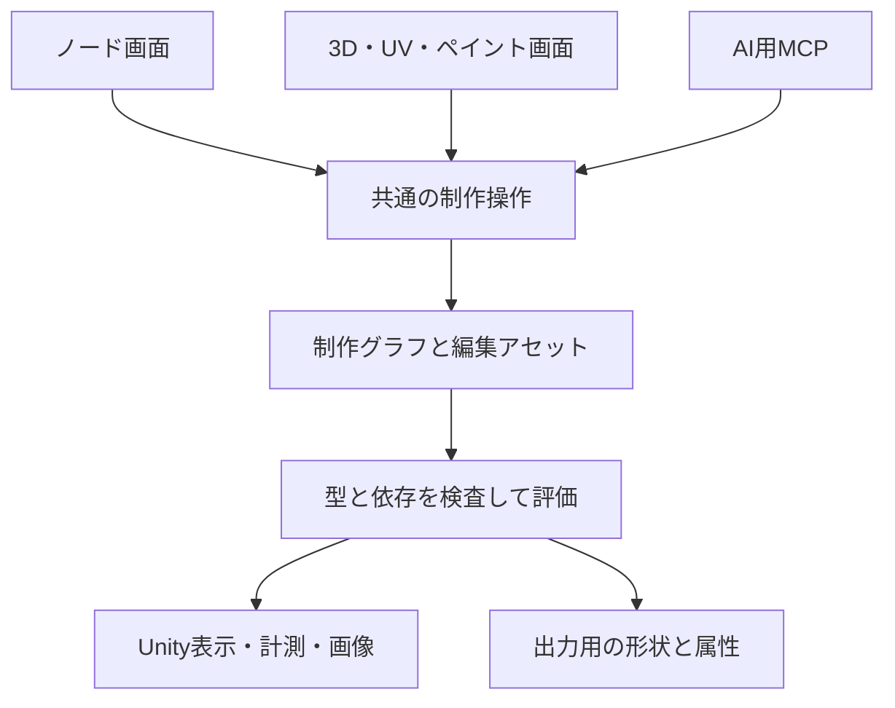
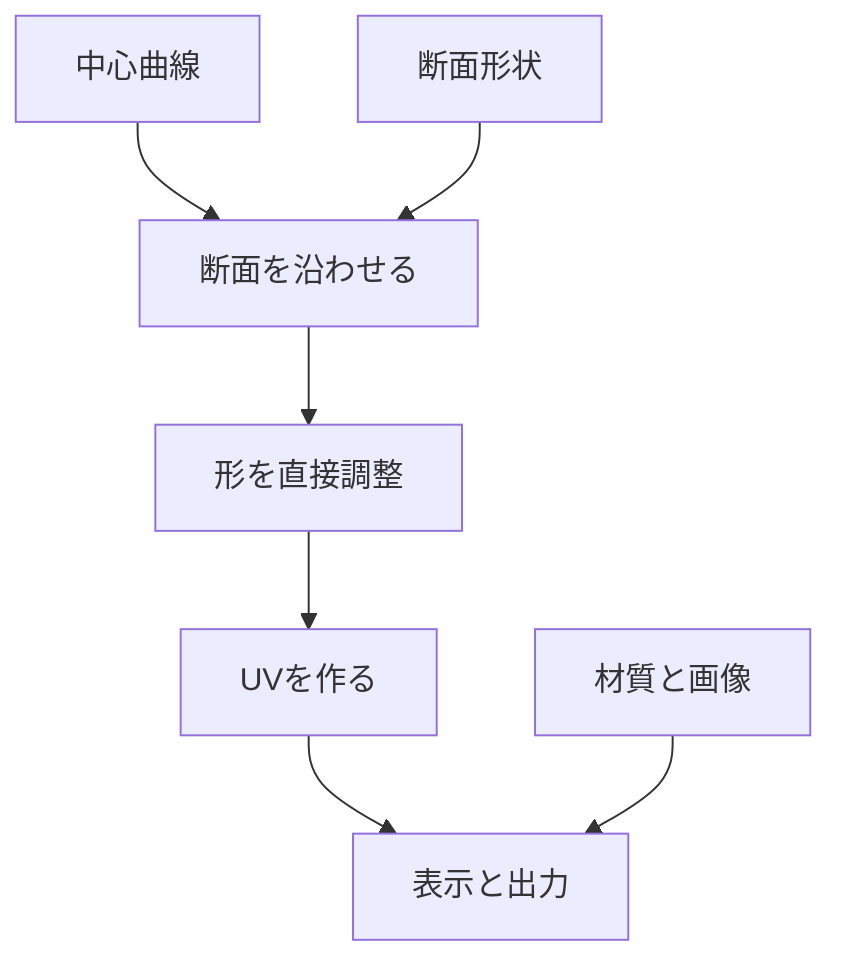

# NyaForge 制作アプリ拡張設計 v2

> ローカル整理（2026-09-11）: 本書を製品目標・全体設計の正本とする。以下の確認コミットと調査結果は持込文書の作成時点の記録であり、未コミットのローカル実装を含まない。現在の実装との差分と着手順は [開発計画](Development-Plan.md)、作業状況は [current_task.md](../current_task.md)、文書の役割は [文書一覧](README.md) を参照。設計v2という名称は保存schemaのversion変更を意味しない。

更新日：2026-09-11  
対象：[moe-charm/NyaForge](https://github.com/moe-charm/NyaForge) / `main`  
確認コミット：`6e1e4fc6d4c88b1b5f3368f3706bcec21a0a9e36`（今回再確認して変更なし）  
状態：実装前の設計提案。ソースの静的確認と一次資料の調査に基づく。Unityでのビルド・実行、実モデルでの計測、依存候補の動作実証は未実施。  
v2の変更：目標を「VRキャラ・衣装・アイテムの制作をBlenderなしで完結」へ明確化。ノード編集を早期導入し、直接造形・UV・paint・rig・weight・morphを製品範囲へ統合。v1の狭い製品範囲と実装順は本版が置き換える。

## 1. 製品目標とv1からの変更

**NyaForgeの目標は、VRキャラクター・衣装・アイテムについて、Blenderを使わずに造形から出力まで完結する制作アプリである。** 既存ビューワーは表示と確認の土台として活かす。チョーカー専用ツールや、Blenderへ編集を戻す補助アプリを最終目標にしない。

v1は保存・座標・非破壊編集の成立を優先したため、最終的に必要な造形機能を狭く設定しすぎていた。このv2は、その製品範囲・ノードの位置づけ・データ構造・開発順を更新する。実装する量を段階的に増やすことと、最終目標を小物に限定することは区別する。

| 項目 | v2で採用する方針 |
|---|---|
| ノードエディター | 早期の主要機能。生成・変形・属性処理の接続を編集する |
| 直接編集 | 頂点・辺・面・曲線・ブラシを3D画面から操作。ノードと同じ制作段を編集する |
| キャラ制作 | 空シーンからの制作と、既存モデルの改変の両方を持つ |
| 必須工程 | 造形、UV、テクスチャ制作、材質、骨、ウェイト、表情、検査、最適化、出力 |
| 正本 | 型付き制作グラフ＋参照する編集アセットをAuthoringDocumentが所有 |
| 外部ソフト | Blender本体・bpy・Blenderのheadless実行を標準経路の依存にしない |
| 最終利用先 | Unity／VRChatのSDK設定・Build & Testは受け取り側環境で行う。モデル制作はNyaForge内で終える |

「Blender不要」は、必要な形を作れず途中でBlenderへ持ち出す工程がないことを指す。表示だけできる、既製素体だけ変えられる、形状ができてもUVやウェイトは外部任せ、という状態は全工程完成ではない。

一方、任意のBlenderファイルや全Blender機能との互換を保証する目標ではない。優先対象は、VRで使うキャラ・服・髪・小物・装飾・簡単な道具。人型キャラを最初のキャラクター完成例にするが、geometry自体は人型に限定しない。

完成を次の3本で判定する。

1. 空シーンから、形を作り、UVと色を付けた小物を出力できる。
2. 既存の体へ衣装を作り、装着・ウェイト・姿勢確認まで終えられる。
3. 空シーンから全身キャラを作り、骨、まばたき、口の動き、材質、髪の揺れ設定を持つモデルを出力できる。

3番目は段階途中の簡単な低ポリキャラでも先に通す。販売水準の美少女キャラ制作は、その上で顔・髪・表情・変形品質を高める別の品質到達点として持つ。

## 2. 現在の実装と設計への影響

| 確認した実装 | そのまま活かせる部分 | 制作機能の追加で必要な変更 |
|---|---|---|
| `PackStore.Verify` | パック・bundleのサイズ、hash、互換tokenの検査 | 編集元データのidentityとCPU可読性の確認を追加 |
| `RendererBindings.Resolve` | 明示的なrendererId。名前・頂点数から同一物と推測しない | mesh identity、頂点対応、骨IDを別に持つ |
| `SessionDocument` | 表示、モーフ、ポーズ、カメラ、確認セット | 制作文書を別に置く。制作Undoへカメラ操作を混ぜない |
| `ViewerApp.Edit` | clone→validation→適用という入口 | 型付きcommand、revision、全体rollback、個別結果へ拡張 |
| `AvatarInstance` | prefab instanceとポーズ・モーフ評価 | 編集するmesh／materialの所有コピーと生成物の寿命管理 |
| `ViewerApp.Reload` | 旧版復元、Recovery状態、ロード要求の整理 | 制作正本をパック解放より長生きさせ、再bindする |
| `ViewerApp.VisualChecks` | PNG・session・metricsの組、同じカメラでの比較 | 汎用撮影serviceへ抽出、snapshot IDと制作物を対象に追加 |
| `JsonFiles` | 厳密なJSON、hash付き保存、一時ファイルからの置換 | 新形式用codecとbinary blob。巨大配列や多態型を押し込まない |

根拠：[PackStore](https://github.com/moe-charm/NyaForge/blob/6e1e4fc6d4c88b1b5f3368f3706bcec21a0a9e36/Assets/Viewer/Runtime/PackStore.cs)、[RendererBindings](https://github.com/moe-charm/NyaForge/blob/6e1e4fc6d4c88b1b5f3368f3706bcec21a0a9e36/Assets/Viewer/Contracts/RendererBindings.cs)、[Models](https://github.com/moe-charm/NyaForge/blob/6e1e4fc6d4c88b1b5f3368f3706bcec21a0a9e36/Assets/Viewer/Contracts/Models.cs)、[ViewerApp](https://github.com/moe-charm/NyaForge/blob/6e1e4fc6d4c88b1b5f3368f3706bcec21a0a9e36/Assets/Viewer/Runtime/ViewerApp.cs)、[AvatarInstance](https://github.com/moe-charm/NyaForge/blob/6e1e4fc6d4c88b1b5f3368f3706bcec21a0a9e36/Assets/Viewer/Runtime/AvatarInstance.cs)。

先に対応する論点は次の6つ。

1. `ViewerApp.Edit` は表示への `Apply` が途中失敗すると、文書が旧状態でもSceneの一部が変更され得る。制作commandでは候補を別に構築してから確定する。
2. `AvatarInstance` はGameObjectを複製するが、編集用meshを個別に所有する仕組みはない。pack由来の `sharedMesh`／`sharedMaterials` へ書き込まない。
3. `AvatarInstance.Apply` はTransformを戻してポーズを評価する。Sceneだけへ書き込んだ変更は消え得る。診断表示の解除先も「現在の制作材質」にする。
4. リロード時に既存instanceとbundleが解放される。制作状態を `ActivePack` やSceneの中だけに保存しない。
5. フレーミングやUIがmanifestのrenderer一覧に依存する。生成物をSceneに追加するだけでは確認対象から漏れる。
6. neckカメラには特定素体の高さに基づく固定値がある。骨・ランドマーク・対象範囲から求める汎用方式へ置き換える。

現在の視覚検査は `Renderer.bounds` を保守的な描画範囲として扱い、実頂点から求めた寸法とは区別している。scale100の衣装で `BakeMesh(false)` と `TransformPoint` の組が期待する結果にならなかったこともコードに記録されている。**このboundsを首周り測定や貫通判定へ転用しない。** [VisualChecks](https://github.com/moe-charm/NyaForge/blob/6e1e4fc6d4c88b1b5f3368f3706bcec21a0a9e36/Assets/Viewer/Runtime/ViewerApp.VisualChecks.cs)

## 3. Blenderなしで完結するための機能表

| 工程 | 必須の最終機能 | 最初に成立させる範囲 |
|---|---|---|
| 作り始める | 空project、primitive、曲線、参照画像、既存モデル読込 | 空シーン＋cube／plane／sphere／curve |
| ノード | 接続、parameter、group、処理段preview、再利用 | 型付きDAG＋少数の形状ノード |
| ポリゴン造形 | 頂点／辺／面編集、extrude、inset、cut、loop、bridge、merge、separate | 選択・移動・押出し・分割・面削除／作成 |
| 形状補助 | mirror、subdivision、solidify、bevel、curve sweep、局所変形 | mirror、厚み、curve sweep |
| スカルプト | grab、smooth、inflate、mask、対称、細部造形 | topology固定のgrab／smooth |
| 低密度化 | 手動retopology、表面へのsnap、必要ならremesh・decimation | 低ポリを直接作る経路。後に高密度→低密度を追加 |
| UV | seam指定、unwrap、島選択・変形・pack、歪み確認 | 単純投影＋島編集、続いて一般unwrap |
| テクスチャ | 2D／3D paint、layer、mask、画像読込、normal／AO等のbake | 色のlayerとpaint、画像保存、UVとの対応 |
| 材質 | Toon／PBR、texture、alpha／cutout、outline、材質graph | 固定shader profileとそのparameter。画像処理graphは段階追加 |
| リグ | bone作成、親子、mirror、rest編集、humanoid対応 | 手動bone＋簡単な人型preset |
| ウェイト | 手動paint、normalize、lock、mirror、transfer、補助自動weight | 明示割当＋paint／normalize。自動結果は修正可能 |
| 表情 | blendshape作成、左右対称、mix確認、viseme／blink／視線設定 | まばたき＋口開き。target別に割当 |
| 髪・衣装 | 髪束／hair card、素体に沿う造形、装着、pose確認 | curve髪束、簡単な衣装、剛体小物 |
| 揺れ | bone chain、collider、制限、target別の揺れ設定 | 1本の髪束chainで設定→受け渡しを確認 |
| 最適化 | polygon・material・texture・bone予算、atlas、必要ならLOD | 対象別の予算と実数の検査 |
| 出力 | Unity、glTF／GLB、必要ならFBX、VRM等 | Unity Bridge、次にruntime GLB、VRM profile |

スカルプトを使わず、低ポリを直接編集してキャラを完成させる経路も必須にする。高密度造形を導入した際は、実際に使う低密度メッシュとテクスチャへ変換する工程までセットで設計する。

高度な布simulation、筋肉simulation、映像用compositing等は初期の必要工程にしない。布simulationがなくても、服を直接作って骨で動かす経路を完結させる。

## 4. ノードと直接編集を統合する構成

ノード画面は「処理をどうつなぐか」、3D／UV／paint画面は「その処理段のデータをどう直すか」を操作する。どちらも共通commandでAuthoringDocumentを更新する。



例えば `MeshSource → EditMesh → Mirror → Subdivide` では、EditMeshを選ぶと低密度の編集ケージを操作し、最終結果を重ねて表示する。ノードを開かなくてもGUIの「頂点編集」から同じEditMeshへ入れる。AIもその処理段をIDで指定する。

「1回頂点を動かすたびにノードを1個増やす」方式にしない。EditMesh／Sculpt／UVEdit／Paint等のノードが編集payloadを参照し、その中を直接編集する。スライダーだけの簡易画面も、同じノードのparameterを変更する表示である。

| 実装領域 | 責務 |
|---|---|
| `Viewer.Contracts / Viewer.Runtime` | 現行の読み込み、描画、確認set、復旧を維持しadapterから利用 |
| `NyaForge.Authoring` | 文書、graph、asset identity、command、history、schema、保存、純粋なgeometry処理 |
| `NyaForge.UnityRuntime` | 編集ケージとrender meshの対応、選択、gizmo、paint表示、preview、撮影、資源所有 |
| `NyaForge.Workspaces` | runtime GUI。Node、Model、UV、Paint、Rig等の各画面を共通commandへ接続 |
| `NyaForge.Mcp` | 外部MCP server。型付き操作と結果の変換 |
| `NyaForge.Export / UnityBridge` | rest mesh・属性・target metadataから出力。Editor依存はBridgeへ隔離 |

これは責務の区分であり、最初から各機能を独立packageへ細分化する指示ではない。初期は既存2 assemblyにAuthoring、UnityRuntime、Editor Bridgeを足し、増えた機能をnamespace／folderで整理する。

中核の文書・graph compilerを `UnityEngine` やMCP SDKへ依存させない。一方、Unity APIを使うgeometry libraryはadapter側へ置ける。利用ライブラリの内部メッシュ形式を、そのまま永久保存形式にはしない。

## 5. 正本：制作グラフと編集アセット

### 5.1 作品・表示・履歴

| データ | 内容 | 正本としての扱い |
|---|---|---|
| `AuthoringDocument` | object、graph、editable mesh、UV、paint、rig、skin、morph、material、出力profileへの参照 | 作品の正本 |
| 不変asset blob | graphや編集ノードが参照する具体的なmesh、delta、画像layer等 | 文書と合わせて作品を再現 |
| `WorkspaceState` | nodeの画面座標、折り畳み、camera、一時選択、表示pose | 作品の意味を変えない表示状態 |
| `CommandHistory` | 文書変更の前後差分、Undo／Redo | 編集補助。過去操作を全再生しなくても現作品を開ける |
| 評価結果 | 制作後のrest geometryと、pose適用後の表示snapshot | 再構築可能なcache。確定・使用中のsnapshotは不変 |

レイヤー一覧を、graphとは別の評価順を持つ第二の正本にしない。特定編集ノードの内部layer、またはgraphの一部分を分かりやすく表示するUIとする。名前を付けて作品から参照する選択mask／領域は制作asset、一時的な選択だけがWorkspaceStateである。

最小文書項目はschemaVersion、documentId、documentRevision、objects、graphs、assetRefs、sourceRefs、exportProfiles、unresolved。graphはnodeId／type／version／parameter／input edge／payloadRef／output bindingを持つ。複雑な自由objectを型名で復元せず、明示したschemaでdecodeする。

`SourceAssetRef` は任意。空projectはsourceRefsが空でも作成・保存・撮影・出力できる。`AvatarInstance` が存在しないだけで制作commandを拒否しない。

### 5.2 制作メッシュと表示メッシュ

制作メッシュはpolygon／face-cornerを表せる形式とする。位置・weight・morphの位置差分は頂点、UV・normal・tangentおよびmorphのnormal／tangent差分はcorner、材質はface domainに結び付ける。morphのnormal／tangent差分に未対応の処理では、その欠落と再計算方針を明示する。頂点・辺・面・cornerはasset内で安定したIDを持ち、Unity表示配列のindexと区別する。

Unityへ描画する際に三角形化し、UV／normal境界で必要な頂点を分割する。`RenderVertexMap` と `RenderTriangleMap` を作り、画面で選んだ三角形／頂点を制作要素へ戻す。出力にも同じ対応を使い、位置・weight・morph位置差分は複写し、corner由来の属性・morph差分は対応する分割頂点へ割り当てる。結合可否はbaselineだけでなく全morph frameの差分も考慮する。UV seamがあるからといって、位置編集でmeshが裂けないようにする。

`MeshValue` はgeometryと属性assetへの参照を持つ。`SkinBinding`／`MorphSet` portは同じ正本assetを渡し、mesh内部と別portに独立した可変コピーを持たない。異なるbindingを入力する場合は、明示したReplace／Compose nodeで適用先を決め、暗黙の優先順位を設けない。topology変更は参照先のdomainと対応表も更新する。

ImportedMeshSourceは、取得できた情報から制作meshを作る。元のquadやseam情報がない三角形meshは、三角形のまま取り込む。元の編集topologyを復元できたと偽らない。GeneratedMeshSourceは生成器versionとparameterを正本に持つ。

adjacencyは編集用に必要だが、巨大な自作geometry kernelを先に完成させない。保存形式はpolygon＋cornerの契約を固定し、half-edge等の内部構造は評価／編集cacheとして実装を選べるようにする。

### 5.3 保存

| ファイル | 内容 |
|---|---|
| `project.nyaforge.json` | 文書、graph、asset hash、schema／generatorのversion |
| `blobs/<sha256>.bin` | mesh、UV、weight、morph、sculpt delta等 |
| `blobs/<sha256>.png` 等 | paint layer、参照画像、texture等 |
| `workspace.json` | node配置、camera、画面layout等 |
| `evidence/` | snapshotに結びつく計測・画像 |
| `exports/` | targetに渡す派生出力 |

保存は新blobを検証して公開した後、manifestを最後に原子的に置換する。途中失敗で前の作品を壊さない。writerは1 projectに1つ、同時起動はlockとversionで制御する。初期はblobの自動GCを行わない。後で追加する場合、Undo／Redo、backup、Recovery、使用中snapshotも参照元として保護する。

paintは確定したlayer画像も正本として持つ。strokeの再生だけに依存させず、ブラシ実装の更新で完成画像が勝手に変わるのを防ぐ。stroke情報は再編集の補助としてversion付きで保持する。

既存 `SessionDocument v1` は確認セットとして維持する。`JsonFiles` は全field必須・未知field禁止、配列20,000要素、JSON8MiBの制限があるので、既存schemaへ巨大graph／meshを追加しない。新形式は別codecとmigrationを持つ。 [JsonFiles](https://github.com/moe-charm/NyaForge/blob/6e1e4fc6d4c88b1b5f3368f3706bcec21a0a9e36/Assets/Viewer/Contracts/JsonFiles.cs)

## 6. 座標・要素ID・編集段の契約

### 6.1 座標と基準姿勢

公開APIはメートル、Y-up、Unityと合わせた左手系、quaternionはx/y/z/w。GUIではmm表示を選べる。通常のobject編集はobjectの固定したreference空間、avatarの体型調整は指定したavatar reference空間を使い、commandにspaceIdを入れる。cameraや再生poseから暗黙に編集空間を決めない。

Importedには `meshToAvatarRest`、Generatedには `objectToAvatarRest` などの完全な基準行列を持たせる。剛体装着はboneId＋reference poseでのattachmentOffsetを保存する。pose中の骨位置を制作の基準へ書き戻さない。

restはimport／制作時に決めたbind／reference poseであり、単に `pose-rest` というclipを選んだ状態と同義にしない。deltaはベクトルとして変換し、normalは必要な逆転置を使う。`lossyScale`を見て100で割る特例は作らない。非可逆scaleは拒否し、負scale・非一様scaleは通したfixtureに基づきcapabilityを宣言する。

最初の直接mesh編集はreference pose・morphゼロ。pose中の頂点ドラッグをrestへ逆算する機能は別工程とする。`BakeMesh`の姿勢適用済み頂点を、元skin付きmeshへそのまま書き戻さない。

### 6.2 identity

| ID／hash | 役割 |
|---|---|
| objectId／nodeId／assetId | どの制作物・処理・assetか |
| vertexId／edgeId／faceId／cornerId | 特定assetの制作要素 |
| domainId／topologyHash | 選択・UV・skin等が対応する要素領域 |
| geometryHash | 基準位置と必要attributeを含む内容 |
| bindingHash | bone、bindpose、reference行列の対応 |
| sourceMapHash | 外部の元要素と制作要素の対応表の版 |

stable IDだけでは、remesh後に同じ頂点がある保証にならない。処理ノードはtopologyを保持するか、対応表を作るか、対応不能かを宣言する。対応はexact／interpolated／approximate／unavailableで区別する。

Unityの頂点indexをBlender等の元頂点番号として扱わない。読み込み時の分割・順序変更があり、逆対応には明示した表が必要。Blenderへの差分出力は任意の互換機能に留め、NyaForge内の制作完結の条件にはしない。 [Unity Model Import Settings](https://docs.unity3d.com/6000.0/Documentation/Manual/FBXImporter-Model.html)

### 6.3 直接編集の前提

直接編集を始めると、対象node／outputを指定したedit sessionを開き、基準snapshotとdomainを固定する。EditMesh、Sculpt、UVEdit、WeightPaint、MorphEdit等のpayloadを更新する。別の処理段を編集しているのに最終meshへ直接書き込むことはしない。

固定baselineの位置deltaなら、その基準geometryが必要。意味付き選択や変形nodeなら、parameterと対象domainを使って再評価する。どちらの方式かをnodeが宣言する。上流の変化に必ず追従するという保証は置かない。

上流変更で前提が壊れた場合は編集payloadを保ったまま未解決にし、固定版の継続、対応確認後の再base、派生版の作成を選べるようにする。詳細なtopologyと属性の扱いは第19節を契約とする。

### 6.4 normal／morph／skin

位置編集の初期動作は、基準位置へdeltaを加え、既存morph deltaを維持する方式。大変形に対する表情品質は自動保証しない。UV、骨ID、weight、bindpose、morphの名前・frameを勝手に削除しない。

評価の意味は、制作後のreference形状→morph差分→poseの骨行列でskin→装着物の同期→描画。通常の出力はreference形状とskin／morphを持つ `RestGeometrySnapshot`、画像はpose適用後のsnapshotを使う。

normalPolicyを明示し、hard edge／corner normal／UV seamを保って再計算する。元normal保持で位置だけ動かした場合は、その状態を検査結果へ記録する。単純な `RecalculateNormals()` はUV seamで見た目が変わり得て、tangentも別途必要になる。 [Unity RecalculateNormals](https://docs.unity3d.com/6000.0/Documentation/ScriptReference/Mesh.RecalculateNormals.html)

## 7. 制作commandとトランザクション

### 7.1 共通入口

`AuthoringCommandService.Execute(CommandEnvelope)` をGUI、MCP、回帰fixtureが共用する。入力は型付きデータ、結果はcommandごとのresult。現在の全体共有 `LastErrorCode` や画面statusからMCPの成功を推測しない。

最低限のenvelopeは `expectedInstanceId`、`documentId`、`expectedDocumentRevision`、`commandId`、対象ID、操作payload。sourceに依存する操作は `expectedSourceEpoch` も要求する。カメラ変更だけでは制作revisionを進めない。

処理順：入力検査 → identity／revision確認 → 候補文書の作成 → project全体の依存graphから変更の影響範囲を再評価 → 数値・構造検査 → main threadで表示候補作成 → commit直前のrevision再確認 → 文書と表示を同時に確定 → 旧資源解放。

影響範囲は変更asset／nodeから依存をたどって求め、object境界で止めない。体の変更が衣装のfit、weight転送、bake画像へ及ぶ場合も含める。結果は直接変更した `modifiedObjectIds` と、再評価で結果が変わった `affectedObjectIds` を区別し、`changedObjectIds` はその和集合とする。

これは通常の `requireValidOutputs` 操作の契約である。ノード接続を作成中の文書は、明示した `allowIncompleteGraph` モードで保存・commitできる。その場合もschema、型、ID、循環の検査は通すが、未接続等で出力が作れなければ `evaluationStatus=incomplete` を返す。documentRevisionは進む一方、最後に成功したpreviewには元revisionを表示する。文書commitの成功と、最新の表示／出力の成立を分ける。頂点編集等の通常操作は既定で有効な出力を要求する。

失敗時は候補だけ破棄し、正本文書、Undo履歴、表示を維持する。source reload失敗のように表示自体を復元できない場合は、旧文書を保持したRecovery状態へ移る。この場合も「完全復旧」と報告しない。

### 7.2 並行操作とUndo

- 制作変更は順序付きsingle-writer queue。reloadのlatest-wins方式を編集commandへ使わない。
- GUIとAIが競合したら古いrevisionの要求を `REVISION_CONFLICT` で拒否する。AIの操作を黙って最新状態へ適用し直さない。
- 同じアプリinstance内で `commandId` を再送したら同じ結果を返す。payloadが違う同一IDは拒否する。再起動時はinstanceIdを変え、古いinstanceへの要求を `STALE_INSTANCE` で拒否する。再起動をまたぐexactly-onceの永続queueは初期には作らず、AIは状態を取り直して判断する。
- Undoは前後の文書差分とblob参照を保持し、毎回全meshを複製して履歴へ積まない。Undo後の新編集ではRedo枝を切る。
- スライダーのdrag中は一時preview。release時に1commandとして確定する。previewは未確定と明示し、通常のexportはcommit済みsnapshotを使う。
- 重い計算は不変のCPU meshをworkerへ渡す。Unity objectの読書きと描画はmain thread。MCPの接続threadから直接Meshを操作しない。

初期の非同期処理はjobId・status・progress・cancelで十分。中止はcommit前なら変更なし、commit後なら結果を返し必要に応じてUndoする。通信timeoutを自動的な失敗／再実行の根拠にしない。

### 7.3 source reload

`AuthoringWorkspace` は `ActivePack` より長生きする。reloadと編集中のcommit／captureを排他し、sourceEpochを進める。新sourceが基準hashと一致すれば再bindする。違う場合は編集を未解決として残す。

同一sourceを再読み込みするだけならsourceEpochだけを進める。異なるsource版を採用し `sourceRefs` やlayerの未解決状態を変える操作は、型付き `source.adopt_revision` commandとしてdocumentRevisionを進め、Undoへ記録する。ロード失敗時は旧sourceRefsを維持する。Undoで必要になった旧sourceを取得できない場合は、旧文書を保持するRecovery状態へ移り、編集内容を消さない。

既存の旧bundle解放→新bundle読込→失敗時の旧版再ロードというメモリー方針は維持可能。二重bundleの常駐を必須にしない。CPUの制作正本と生成物の必要データは別所有とし、Unity参照をリロード後に引き直す。 [ReloadLoop](https://github.com/moe-charm/NyaForge/blob/6e1e4fc6d4c88b1b5f3368f3706bcec21a0a9e36/Assets/Viewer/Runtime/ViewerApp.Reload.cs)

## 8. AIが使いやすいMCP

### 8.1 接続

MCP serverは外部の小さなC#プロセスとし、公式C# SDKを使う。Unity本体へSDKとその依存を抱え込む必要を減らす。最初はAI client↔sidecarをstdio、sidecar↔NyaForgeを明示したinstanceへのローカルIPCとする。IPCはWindowsではnamed pipeを第一候補にし、接続相手のinstance IDを確認する。複数起動中に適当なアプリへ自動接続しない。 [公式C# SDK](https://github.com/modelcontextprotocol/csharp-sdk)、[MCP transports](https://modelcontextprotocol.io/specification/2025-06-18/basic/transports)

リモート接続は別段階。Windows上のNyaForgeと別室サーバー上のAIを結ぶ必要がある場合、認証と暗号化を備えた接続方式を追加する。最初からLANへ無認証公開する設計にはしない。

MCP adapterはprotocolを変換するだけ。生成・検査の仕様をsidecarへ重複実装しない。新規generatorを追加してもcommandの正本はアプリのschema registryにあり、MCPの説明はそこから出す。

### 8.2 ツール案

名前は提案。粒度と契約を固定し、実装時に統一する。

| ツール | 目的 | 重要な入力／出力 |
|---|---|---|
| `forge_capabilities` | 利用できる操作を知る | 実装済みgenerator、形式ごとのattribute対応、制限 |
| `forge_get_state` | 現在地を短く知る | instanceId、documentId、revision、sourceEpoch、dirty、object概要 |
| `forge_inspect` | 必要な対象だけ調べる | objectIds、node output、fields、cursor。寸法・mesh・材質・骨の要約 |
| `forge_graph_inspect` | 部分graphと操作仕様を知る | graphId、nodeIds、ports、schema、未解決依存 |
| `forge_edit_context` | 編集する処理段を固定する | objectId、nodeId、outputPort、mode → contextIdとsnapshot／domain |
| `forge_select` | 意味のある範囲を選ぶ | contextId、領域／明示要素／face group → selectionIdと対象数 |
| `forge_apply` | 生成や編集をまとめて実行 | revision、commandId、型が決まったoperations配列 |
| `forge_set_view` | カメラ・ポーズ・表示を変更 | 対象・view preset・pose。制作履歴を増やさない |
| `forge_capture` | 同一snapshotを多方向から確認 | objectIds、views、mode、解像度、比較cameraId |
| `forge_validate` | 出力前の検査 | profile、pose set → pass／fail／unknownと根拠 |
| `forge_history` | Undo／Redo | action、expected revision → 新revision |
| `forge_save_project` | 制作状態を保存 | workspace内の保存先、期待する保存version |
| `forge_export` | 指定対象を受け渡す | format/profile、objectIds、snapshot ID |
| `forge_export_glb` | revision固定の標準GLBを書き出す | static/skinned/skinned_extended、exportId、未対応資源のloss境界 |
| `forge_job` | 長い処理を確認・中止 | jobId、action → status／result |
| `forge_read_artifact` | 詳細画像・データを取得 | artifactId、必要ならcrop／chunk |

`forge_apply` にproject作成・openのoperationも持たせ、空projectをAIから作れるようにする。既存projectに未保存の制作物があれば、無言で破棄しない。

`forge_apply` のoperationsは巨大な自由JSONではなく、operationごとにschemaを持つ。初期は `project.create`、`node.add`、`node.connect`、`node.set_parameters`、`mesh.offset`、`mesh.extrude`、`object.set_attachment` 等を公開する。`accessory.create` のような便利命令は同じgraph操作のbatchへ展開し、別の隠れた生成処理を持たない。任意C#実行は通常経路に含めない。

AIが「首に幅25mmのチョーカー」と解釈したら、発見済みの首boneId、幅0.025m、断面寸法、分割数を明示したcommandに変換する。MCP自身が曖昧な自然言語から自動造形できる前提にはしない。

### 8.3 JSON例

以下は提案schemaの説明用。数値とIDは架空であり、現モデルの測定結果ではない。

```json
{
  "documentId": "project-example",
  "expectedInstanceId": "instance-example",
  "expectedDocumentRevision": 12,
  "expectedSourceEpoch": 3,
  "commandId": "cmd-example-001",
  "operations": [
    {
      "type": "node.set_parameters",
      "graphId": "graph-accessory-001",
      "nodeId": "choker-generator-001",
      "parameters": {
        "widthMeters": 0.025,
        "thicknessMeters": 0.002
      }
    }
  ],
  "evidence": {
    "views": ["front", "right", "back"],
    "imageSize": 768
  }
}
```

```json
{
  "commandId": "cmd-example-001",
  "status": "committed",
  "documentRevision": 13,
  "sourceEpoch": 3,
  "snapshotId": "snapshot-example-013",
  "changedObjectIds": ["accessory-001"],
  "geometryValidation": "pass",
  "fitValidation": "unknown",
  "warnings": ["Fit has not been measured for this pose."],
  "artifacts": [
    { "artifactId": "image-example-front", "mimeType": "image/png" }
  ]
}
```

`evidence` は任意で、編集直後の確認を1回の呼出しにまとめられる。制作のcommit成功と撮影成功は別結果とする。撮影失敗を理由に制作済みcommandをもう一度実行しない。

MCPの返答では構造化JSONに加え、画像そのものを `image` contentとして返せる。ローカルPNGのpath文字列だけでは、AIが画像を見たことにはならない。summaryと小さい画像を既定にし、全頂点や全階層は必要なときにchunkで取得する。 [MCP tools：structuredContent・image・resource](https://modelcontextprotocol.io/specification/2025-06-18/server/tools)

### 8.4 失敗を次の操作につなげる

| code | 意味 | 戻す情報 |
|---|---|---|
| `REVISION_CONFLICT` | GUI等で正本が進んだ | 現revisionと変更object概要 |
| `STALE_INSTANCE` | アプリが再起動した／別instanceだった | 現instanceIdと状態再取得の案内 |
| `SOURCE_CHANGED` | 元パックやbindingが変わった | 期待値・現在値、再bind要否 |
| `MESH_NOT_EDITABLE` | CPUデータや必要なattributeがない | 足りないcapability |
| `BASE_MESH_CHANGED` | layerの基準が変わった | 未解決layerと対応候補 |
| `SELECTION_STALE` | 古いsnapshotの選択 | 再選択に必要なsnapshot |
| `BUDGET_EXCEEDED` | 分割数等が設定予算を超える | 実数・予算・調整可能な項目 |
| `EXPORT_UNSUPPORTED_FEATURE` | 出力形式で保持できない | morph／skin／shader等の欠落一覧 |
| `CAPTURE_FAILED` | 画像の取得・検証失敗 | 制作commitの成否と再撮影先 |

タイムアウトや未検査をsuccessへ丸めない。capabilitiesは「将来実装予定」まで列挙しない。

### 8.5 graph・直接編集・ブラシの共通化

graphの追加／接続／parameter変更も、mesh・UV・paint・weight等のpayload更新も、同じtransactionへ入れられる。payloadを更新する際はcontextId、inputSnapshotId、domainIdを検証する。誤った処理段を対象にした変更は `EDIT_CONTEXT_STALE` 等で拒否する。

例えば「袖を伸ばす」場合、袖のEditMesh段を開き、名前付き袖口face groupを取得し、extrude＋位置調整を一つのbatchにする。全頂点を会話へ列挙しない。UVやweightへの移行結果も返し、必要なら同じviewでbefore／afterを撮影する。

paintはstrokeの始点／経路／筆設定／対象surfaceを構造化して渡せる。人間の入力イベントの列をそのままMCPへ公開する方式にはしない。画像への投影・塗りつぶし・mask作成などAIがまとめて指定しやすい操作も用意する。

比較する画像はnode input、node output、最終結果を選べる。graphの画像だけを渡すのではなく、port型、parameter、接続、検査結果も構造化して返す。グラフ全体が大きい場合は対象nodeと依存する部分だけを返す。

## 9. 画像と数値による確認

### 9.1 同じ結果から出す

`EvidenceService` が不変の `EvaluatedSnapshot` を受け、画像とmetricsを出す。識別情報は `documentRevision`、`sourceEpoch`、`workspaceRevision`、graphId／node output、pose/time、generator version、mesh hash、snapshotId、render profile。空projectではsourceなしと明示する。

MVPでは撮影中に短い排他区間を作り、ポーズを止め、同じ評価結果から撮影する。複数viewはそれぞれcamera情報を記録する。GUIが撮影中にposeを変えても、画像とmetricsの対応が崩れないよう要求をqueueへ置く。

### 9.2 撮影

既定はassetだけを表示する専用cameraとRenderTexture。UIを含む全画面撮影はGUI検査用の別modeとする。現在の `VisualCapture` から、session／metricsを伴う証跡の考え方と検証を抽出する。制作時の証跡にはv2文書・workspaceのsnapshot参照と撮影設定を記録し、既存viewer sessionは対応するpackがある場合の補助出力に限定する。空projectをv1 sessionへ無理に変換しない。特定clip名・特定小物pathを使う既存suiteは、汎用serviceではなくfixture側へ残す。

用意するviewはfront／back／left／right／斜め、対象のみ、素体と同時表示、wireframe、UV checker、材質確認。top／bottomは必要時に追加する。

変更前後比較ではcamera、pose、照明、露出、解像度を固定する。毎回対象boundsへ自動fitし直すと、サイズ変更を見誤るため、比較用cameraIdを再利用する。画像にはaxis・単位・view名を必要に応じてoverlayできる。

PNGの生成完了、寸法、デコード、対象が画角内にあることを確認する。GPUや描画環境がない場合は画像検証を実施済みとしない。APIの意味上同じ状態でも、異なるGPUのpixel hash一致は要求しない。

### 9.3 metrics

| 種別 | 内容 | 判定上の注意 |
|---|---|---|
| 構造 | 頂点数、三角形数、submesh、材質slot、UV、normal、bone、blendshape | 頂点数と三角形数を混同しない |
| 寸法 | rest／pose評価後の実頂点に基づくAABB、指定点間距離 | Renderer.boundsとは別field |
| 形状健全性 | 非有限値、範囲外index、退化面、開いた境界、非多様体等 | 意図した開口はprofileで区別 |
| skin | weight合計、欠落bone、bindpose、poseごとの変形 | restで綺麗でも姿勢で破綻し得る |
| フィット | 指定部位との距離、交差、検査poseと時刻 | 未実装／未測定はunknown |
| 負荷 | 実際のtriangles・材質数・textureサイズ・生成時間 | 販売品質やVRChat性能ランクを自動保証しない |

フィット検査は最初から「貫通ゼロ」を返さない。距離sample、三角形交差、閉じた体表への内外判定は違う処理である。どの方法を使い、どの頂点・面・poseを調べたかを記録する。開いたmeshで符号つき距離を信頼できない場合は、その限界を返す。

結果は `pass / fail / unknown`。画像での見た目の良さは人間またはAIの評価を別記録とし、数値検査のpassと同一に扱わない。

## 10. 小物・衣装・キャラクターの制作経路

### 10.1 小物

primitive／curveから始め、直接編集・mirror・sweep・厚み・bevelで形を作る。UVを展開し、textureと材質を作り、必要ならboneへ装着して出力する。チョーカーやリボンは、この共通機能を組んだnode groupとして提供する。

「チョーカー生成」専用の見えない別経路を作らない。group内を開いて曲線、断面、分割数、結び目等を調整でき、人間もAIも同じ操作を使える。

### 10.2 衣装

体表の選択領域から別meshを作る方法と、plane／curveから新しく作る方法を用意する。体表由来の衣装は元の体を変更しない。裾・袖・襟を直接造形し、surface fit／厚み／保護maskで調整する。

UV・paint・材質の後、骨対応とweightを設定し、肩上げ・肘曲げ・前屈等で検査する。体型morphへの対応は別のmorph作成／転送工程として明示する。元の体を非表示にするmaskも、衣装へ適用する出力設定として管理できるようにする。

自動fitは、対象領域、最大距離、向き、保護点を持つ制約付き処理。最近傍面へ寄せるだけで、脇や折れた布の裏側へ吸着する問題を解決した扱いにしない。自動weightも結果をpaintで直せることを必須にする。

### 10.3 全身キャラ

| 制作段階 | 作るもの／修正するもの |
|---|---|
| 大きな形 | 胴体、頭、手足、必要なら耳・尻尾。primitiveとmirror、低密度mesh編集 |
| 顔 | 目・口まわりのedge loop、瞼、眼球、口腔、必要な歯・舌、輪郭 |
| 髪 | curve髪束、polygon髪、hair card。生え際と顔周りの修正 |
| 表面 | UV、肌・目・髪のpaint、Toon等の材質、必要なbake |
| 骨 | 自作skeletonまたは人型presetを配置しreference poseを確定 |
| 変形 | weight、関節の変形、必要なら補正morph |
| 表情 | 瞼・眉・口等のmorph。blink、viseme、視線へのtarget別割当 |
| 揺れ | 髪・尻尾・装飾のchain、collider、制限。target adapterで出力 |
| 確認 | 複数pose、表情mix、材質、貫通、polygon／texture等の予算 |

人型presetを使うことは選択肢とし、既成の素体を購入しなければ作れない構造にしない。最初の自作キャラは単純な形でもよいが、目・口・髪・関節を含め、制作工程が欠けていないことを確認する。

顔の可愛さや自然な変形は、ノード接続やmeshの健全性検査だけで保証できない。参照画像、複数角度、表情の組合せを見て、人間とAIが修正を繰り返せる操作性を重視する。

### 10.4 高密度から低密度へ

高密度sculpt meshと使用する低密度meshを別assetとして関連付ける。retopologyは新しい面を置き、参照surfaceへsnapして作る経路を持つ。normal／AO等のbakeは、high、low、UV、cage／ray設定、tangent規約を明示して実行する。

高密度meshを出力して完成としない。低密度mesh、UV、texture、rig／morphが揃うところまでを工程として扱う。最初は低ポリ直接造形で全体を通し、その後にsculpt／retopologyの品質を拡張する。

## 11. 入力：既存パックと空projectを両立する

> 具体化仕様（2026-09-12）: [モデル取込・情報保持・保存・出力](Model-Interchange-Spec.md)。native正本/交換形式/入力原本の区別、情報別能力、座標/identity/容量の検証を定める。ここで定めるBlenderなしの制作完結と標準Bridge経路は維持する。

現在のNyaForgeは準備済みAssetBundleパックを開き、公開repoにアバターやprivate pack builderは含まれない。この入力経路は維持するが、v2の制作開始条件にはしない。 [README](https://github.com/moe-charm/NyaForge/blob/6e1e4fc6d4c88b1b5f3368f3706bcec21a0a9e36/README.md)

起動時に「新しく作る」「制作projectを開く」「モデルを取り込む」「確認用パックを開く」を持つ。新規sceneはrig、animation、packがゼロでも正常な状態。現在のManifest validationを緩めて混在させず、source種別のadapterを分ける。

| 入力 | 役割 |
|---|---|
| 空project／native asset | NyaForgeだけで一から制作する標準経路 |
| 既存のviewer pack | 見た目の確認、既存作業の継続 |
| glTF／GLB | runtimeで扱う交換形式の第一候補 |
| VRM | キャラ・humanoid・表情等を伴う入力。専用adapter |
| FBX | 必要なモデルの取り込み。初期はUnity Bridge、runtime importerは別途選定 |
| 画像 | 制作参照、texture、paint layerの素材 |

objectごとにviewable、measurable、editable、rigEditable、exportable等を返す。Unityで表示できるmeshでもCPU可読とは限らない。必要な場合はreadable設定か対応hash付き編集blobをpack作成側から供給する。コピーしただけで読み取れるようになる前提を置かない。 [Mesh.isReadable](https://docs.unity3d.com/6000.0/Documentation/ScriptReference/Mesh-isReadable.html)

制作可能性を保証できないpackは確認用として開ける。新規制作とnative保存はその制限に巻き込まない。全回帰fixtureは自作のmesh／rigで動かせるようにする。

## 12. Unityへの出力

### 12.1 初期の標準経路

**NyaForge native project → Bake DTO → Unity Bridge → Mesh.asset／Material／Prefab** を先に完成させる。

Bake DTOは、選択objectの実際のgeometry、UV、normal、tangent、submesh、必要ならskeleton階層・reference pose・skin・blendshape、texture参照、装着先bone ID、humanoid対応、表情・視線・揺れのtarget metadata、座標系、hash、機能一覧を含むversion付きmanifest＋binaryとする。Unityのasset内部形式を実行アプリから直接手書きしない。

通常のskin付きexportは、制作後の `RestGeometrySnapshot` とskin／bindposeを使い、現在のposeで変形済みの頂点を書き戻さない。姿勢ごと固定したstatic meshの出力は別profileとして明示する。撮影用の評価結果と出力用の基準形状は、同じdocumentRevisionへ結びつけて比較する。

受け取り側Editorで型付きDTOを読み、Meshを構築してassetとして保存する。新規キャラならDTOのskeletonから骨階層を作り、humanoid対応を検査する。既存アバターへ装着する場合は明示bone対応を検証し、同名の別boneへ推測で接続しない。C0では非装着のstatic mesh、C1では必要に応じてbone一本への装着、C2では新規skeletonとskin／morphを扱う。

これにより、制作アプリのUnity版と最終利用先のUnity版を分けられる。NyaForgeが作ったAssetBundleを別版のUnityへそのまま渡す方式にしない。

再出力時は、受け取り側に保存した `documentId／outputId → Unity asset GUID／生成object・bone` の対応を使って同じ出力対象を更新する。内容hashをasset identityにしない。Bridgeが所有するmesh・材質・生成階層と、Unity側で利用者が追加したcomponent・設定を区別する。未管理の設定を黙って削除せず、削除・骨対応変更・設定競合は更新previewへ出す。これにより「制作→Unity確認→修正→再出力」を繰り返せる。

### 12.2 出力形式の方針

| 形式 | 用途 | 採用方針 |
|---|---|---|
| native project | 続きの制作 | レシピとlayerを保持する正本 |
| Bake DTO＋Unity Bridge | Unityで実際に使う | 最初の標準経路 |
| GLB／glTF | 一般的な交換・preview | exporterの機能を検証して追加 |
| VRM | キャラの交換・VRM対応環境での利用 | 専用profileでhumanoid・expression・metadata・spring等を扱う |
| FBX | 既存のモデリング／販売工程 | Editor bridge側のexportを先に検証 |

Unity Editorにあるimport／AssetDatabase／Undoの機能が、standalone playerでもそのまま使える前提を置かない。runtimeでは独自の保存・履歴を用意する。 [Unity AssetDatabase](https://docs.unity3d.com/6000.4/Documentation/ScriptReference/AssetDatabase.html)、[Unity Undo](https://docs.unity3d.com/6000.4/Documentation/ScriptReference/Undo.html)

公式資料を確認した候補比較は次のとおり。これはNyaForgeでの動作実証ではない。

| 候補 | 確認できた仕様 | 判断 |
|---|---|---|
| Unity FBX Exporter 5.1.6 | 既定はEditor専用。`FBXSDK_RUNTIME` と独自exporterで64bit Win／Mac／Ubuntu playerにも対応可能 | 初期はEditor Bridge経由。runtime FBXを不可能とは扱わない |
| Unity glTFast 6.14系 | runtime exportはあるがExperimental。対応表でmorph／animationのexportは未対応 | static小物の候補。全アバターの保存へ一律採用しない |
| Khronos UnityGLTF | runtime import／export、skin／blendshape等を公式READMEで案内 | より多くの機能を持つGLB出力の比較候補。版を固定してfixture試験 |

出典：[FBX Exporter API](https://docs.unity3d.com/Packages/com.unity.formats.fbx@5.1/api/index.html)、[glTFast機能表](https://docs.unity3d.com/Packages/com.unity.cloud.gltfast@6.14/manual/features.html)、[UnityGLTF](https://github.com/KhronosGroup/UnityGLTF)。

GLBに保存できたことだけで、morph・animation・shaderまで保存できたとは見なさない。出力profileごとに機能表を持ち、必要attributeを落とす場合は `EXPORT_UNSUPPORTED_FEATURE` を返す。簡略化した出力は明示した別profileで行う。

### 12.3 VRChatの境界

制作レシピを実行するNyaForge独自MonoBehaviourを、VRChatアバターへ残して動かす設計にはしない。制作結果を通常のmesh・材質・bone等へ確定し、VRChat側の設定は対応Unityプロジェクト内で行う。許可外のcomponentはVRChatで動かず、uploadを阻害する場合がある。 [VRChat Allowed Avatar Components](https://creators.vrchat.com/avatars/whitelisted-avatar-components/whitelisted-avatar-components/)

今回取得できたVRChat公式ページはUnity `2022.3.22f1` を指定している。一方NyaForgeのREADMEは `6000.4.3f1` を指定する。実装時には対応版を再確認し、Bridgeを受け取り側の版に合わせる。 [VRChat Current Unity Version](https://creators.vrchat.com/sdk/upgrade/current-unity-version/)

NyaForgeの表示とVRChat内の見え方は、Unity版、shader、lighting、SDK／Avatar Dynamics等で差があり得る。NyaForgeでの確認は制作時の証拠とし、最終互換性は受け取り側UnityとVRChat側で確認する。完成条件に「別プロジェクトへの再読込」を含め、VRChat対応を名乗る段階ではSDKのBuild & Testも行う。 [VRChat Local Avatar Testing](https://creators.vrchat.com/avatars/#local-avatar-testing)

### 12.4 target metadataと再利用可能な出力

VRChat profileではavatar descriptor、humanoid、視線、blink／lip sync、必要な表情設定、PhysBones等へ変換する。NyaForgeの意味データとSDK固有の値は分け、対応できない設定はloss reportへ出す。揺れの簡易previewが同じ数値でも同じ挙動になるとは扱わない。 [VRChat PhysBones](https://creators.vrchat.com/common-components/physbones/)

VRM profileはVRMの対応version、meta、humanoid、expression、look-at、spring等を専用adapterで扱う。VRChat設定をそのまま流用する形式にはしない。UniVRMはruntime import／export候補であり、採用する版の対応機能を確認する。 [VRM 1.0](https://vrm.dev/en/vrm1/)、[UniVRM](https://github.com/vrm-c/UniVRM)

Unity BridgeはNyaForgeのレシピを再生せず、通常のmesh／texture／rig等へ組み立てる。完成したPrefabを使う利用者にNyaForge runtimeやBlenderを必須にしない。制作者が再編集するためのnative projectと、利用者へ渡す成果物を区別する。

## 13. 人間用ワークスペースとノード画面

中央の3D表示、左のobject／asset一覧、右のparameterを共通にし、下部または独立panelにnode editorを置く。Model、Sculpt、UV、Paint、Rig、Expression、Preview、Exportを作業モードとして切り替える。別アプリのような独立保存状態を持たせない。

ノード画面は初期から追加、削除、接続、切断、parameter、複数選択、frame、group、処理段previewを持つ。型の合わないportや循環は接続時に理由を表示する。未接続や未解決nodeは消さず、どこを直せばよいかを表示する。

3D画面で頂点編集を始めたら、対象nodeと編集段を明示する。「編集ケージ」「この段の結果」「最終結果」を切り替え／重ねて見られるようにする。subdivision後の表示頂点を直接操作したつもりで、違う元頂点を変更する曖昧さを避ける。

ノードの画面上の移動や折り畳みはworkspaceRevisionだけを変える。接続・node parameter・編集assetの変更はdocumentRevisionを変える。graphの接続と3Dの直接編集を1回のUndoで戻せるよう、編集gesture単位でcommandをまとめる。

AIはnodeの画面座標へマウスクリックする必要がなく、nodeId／portId／editContextを使う。人間は同じ結果をGUIで直し、AIの操作も同じUndoで戻せる。

UnityのGraphViewは `UnityEditor.Experimental.GraphView` のAPIで、standaloneのnode画面へそのまま使う前提にしない。runtime UI Toolkit等を使ったcanvas、またはruntime対応を実証した部品を使う。最初は動くnode canvasと型付き接続に絞り、巨大なノードUI基盤の自作を先行させない。 [Unity GraphView](https://docs.unity3d.com/6000.0/Documentation/ScriptReference/Experimental.GraphView.GraphView.html)

## 14. 実装順：ノードを早期に入れ、全キャラの制作を先に一周する

| 段階 | 実装 | 終了条件 |
|---|---|---|
| C0 基盤の実証 | 空project、reference座標、mesh ownership、保存／Undo、最小Unity Bridge | packなしの自作meshを既知量だけ変更し、別Unityへ往復する |
| C1 ノードと小物の完結 | node canvas、型付き接続、primitive／curve、EditMesh、mirror／厚み、簡単なUV・色paint、MCP・画像 | 空から小物を作り、ノードと直接編集を混ぜ、色付きで出力・再編集する |
| C2 簡単な全身キャラの完結 | 面の造形、簡易unwrap、manual rig／weight、morph、髪束、target設定 | 低ポリ全身キャラを空から制作。目と口、関節、1髪束の揺れを持ち、受け取り先で動く |
| C3 衣装・髪・顔の実用化 | loop／bridge／bevel等、curve髪、一般UV、paint layer、制限つきfit、weight補助、表情mix | 自作キャラへ衣装を新規制作し、複数poseで直せる |
| C4 造形品質の拡張 | 固定topology sculpt、subdivision、retopology、high→low bake、skin補正 | 販売を想定する顔・髪・服を、形と表面と変形まで仕上げる |
| C5 仕上げと互換性 | atlas／最適化、target profile、runtime GLB／VRM、必要なFBX、品質検査 | 実際の受け取り環境で外観・表情・動き・予算を確認する |

C0の「1頂点が動く」は内部の成立確認であり、製品の完成点ではない。C1ではノードUIを実際に使い、C2では全身キャラを早期に一周させる。リボンの種類を増やし続けてキャラ制作を後回しにしない。

最初のnode集合はMeshSource／Primitive／Curve／Sweep／EditMesh／Mirror／Solidify／UVProject／MaterialAssign／Outputを候補とする。Subdivisionは品質検証後に追加する。C1で全候補を同時に必須とせず、完成例に使う少数から着手する。

最初の小物例は「planeから押し出して作った色付きペンダント」や「curveをsweepしたチョーカー」。既製generatorだけを呼んで終わる例にしない。C2のキャラは造形品質より全工程の欠落発見を優先する。

最初の変更単位は、空projectとasset/source非依存のcommand入口、次にtyped graphと小さいnode canvas、その次にEditMeshと出力。v1の既存pack前提の入口や、ノードを後回しにする順序をそのまま継続しない。

## 15. 意味のある受け入れ検証

| 検証 | 防ぐ失敗 |
|---|---|
| 同じcommandをGUIとMCPから適用しmesh hashを比較 | 2つの入口で処理が分岐する |
| delta適用→Undo→Redo→保存→再読込 | 見えている結果だけ保存され、編集正本を失う |
| 2操作batchの2つ目を意図的に失敗させる | 1つ目だけ適用された半端な結果 |
| 同じcommandIdを再送する | 小物が二重生成される |
| アプリ再起動後に旧instanceIdで再送する | 保存前の操作を誤って再適用する |
| GUI変更後に古いrevisionでMCP実行 | 人間の直近操作が上書きされる |
| sourceを同じ頂点数・別順序に変える | 違う頂点へdeltaが適用される |
| 制作物がある状態でpack reload失敗 | 編集物が消える、または古いUnity参照を使う |
| scale1／100、非一様scale、skinned poseの既知座標 | 二重scale、二重skin、間違った寸法 |
| モーフ・UV seam・hard normalを含むfixtureの往復 | 頂点分割、normal、blendshapeが欠落する |
| 撮影中にpose変更を要求する | PNGとmetricsが違う状態を示す |
| 診断材質→通常材質へ戻す | 新しい制作材質が元材質へ消える |
| 別Unityプロジェクトで出力を読込 | NyaForgeだけで表示できる独自成果物になる |

自作fixtureで自動化する。描画を要する検証はWindows上のPlayerで行う。現行のAcceptance／VisualChecksは読んだ範囲では実装として存在するが、この設計作成時に実行して合格を確認したわけではない。

数値の許容誤差はfixtureの寸法と用途から決める。暫定例としてメートル座標のround-trip誤差を評価するが、GPU画像の完全一致や全機材で同じ処理時間を要求しない。triangles数・生成時間・メモリーの既定予算はC0で測り、設定値として公開する。

## 16. 未確認事項と先行する技術検証

| 確認すること | 影響 |
|---|---|
| 既存packの可読性、元要素への対応 | 既存モデルの編集範囲。空project制作は独立して進める |
| runtime node UI | Editor APIを持ち込まず、Playerで接続・描画・選択できるか |
| geometry libraryのattribute保持 | extrude／mirror等でUV・normal・skin・morphが欠落しないか |
| UV unwrap／packing | cornerの対応、歪み、島間padding、規模別性能 |
| 3D paint→保存／再読込 | UV seam、色空間、alpha、layer blendの再現 |
| rig／morph→出力先 | reference形状、bone、bindpose、blendshapeが往復するか |
| VRChat／VRMのtarget profile | 最終利用環境と必要な表情・揺れの仕様 |

時間の見積もりは、この検証と既存実装の状態を見て行う。ノードUIが動くことと、モデラー全体が完成することは違う。特にgeometryの属性移行、顔・関節の品質、UV／paintは大きな開発対象として扱う。

## 17. 既存部品の再利用候補

以下は一次資料で確認した候補であり、NyaForgeへの採用済み依存ではない。単にUnity内で動く例があるだけで、standalone対応や編集属性の保持を保証しない。

| 候補 | 確認できた役割 | 採用条件 |
|---|---|---|
| ProBuilder | runtimeで使えるmesh作成・編集APIと、別のEditor APIを持つ | 操作ごとのcorner／ID／skin／morph保持をadapterで検証。全機能をEditor専用ともruntime対応とも一括扱いしない |
| xatlas | UV parameterization／atlas生成 | native連携、seam／corner対応、既存UVの扱い、packing結果を検証 |
| OpenSubdiv | subdivision surfaceの処理 | control cageと出力の対応、crease／UV等、配布とnative連携の費用を検証 |
| UniVRM | Unity向けVRM／glTF実装、runtime import／export | 対応version、VRM metadata・expression・spring設定、既存runtimeとの整合を検証 |

参照：[ProBuilder API](https://docs.unity3d.com/Packages/com.unity.probuilder@6.0/manual/api.html)、[xatlas](https://github.com/jpcy/xatlas)、[OpenSubdiv](https://github.com/PixarAnimationStudios/OpenSubdiv)、[UniVRM](https://github.com/vrm-c/UniVRM)。

最初から全部を導入しない。C1で必要なprimitive／編集処理、UVの不足、C2以降のVRM等を順に評価する。ライブラリを使ってもBlenderを起動する依存がなければ製品目標と両立する。各依存の利用・配布条件は固定する版で確認する。

## 18. 型付き制作グラフの詳細

### 18.1 ノードとport

形状、画像／材質、rig／deformerは型付きのdomainを持ち、同じUI操作を利用するが、無型の万能graphにはしない。objectごとのgraphはasset参照を介してつながり、project全体で依存循環を検査する。

| port型 | 内容 |
|---|---|
| Mesh | polygon／corner attributeを持つ制作mesh |
| Curve | 制御点、接線、閉曲線等の指定 |
| Selection／Field | domainに対応する要素集合、mask、変形量など |
| SkeletonRest | bone identity、親子、reference姿勢 |
| SkinBinding | mesh domainとskeletonへのweight／bindpose |
| MorphSet | reference meshに対応したtarget／delta |
| Image／TextureSet | 色空間とchannel意味を持つ画像・画像群 |
| Material | shader profile、texture・parameter・描画状態 |
| Scalar／Vector／Transform | 単位・空間を明示した値 |

例えばMesh出力をImage入力へ直接つながせない。Selectionは型が合うだけでなくdomainも一致する必要がある。受け取れないattributeは診断に出す。

各node定義はtypeId、implementationVersion、parameterSchema、input/output、必要attribute、topology policy、attribute policy、対応する編集モード、計算上限を持つ。node instanceはdefinitionを参照し、parameterとpayloadRefを保存する。

### 18.2 評価

入力検査→型・依存検査→topological順でdirty部分を評価→属性検査→候補snapshot公開とする。キャッシュkeyにはnode version、入力hash、parameter、外部asset hash、seed、必要ならquality profileを含める。表示のためだけのnode移動で再計算しない。

preview品質とexport品質で分割数が違う場合、両者のdomainを同一視しない。直接編集は安定したcontrol cageを対象にし、exportの高密度meshへvertex indexで差分を貼らない。

循環は拒否。cloth等の時間依存処理は、初期状態、時間範囲、反復上限、seed等を持つ専用node内で扱い、結果を必要に応じてbakeする。未来のframeを入力に戻す自由な循環graphは初期に作らない。

形状が部分的に未完成でもprojectを保存できる。評価不能のnodeがある場合は最後に成功した結果を古いpreviewとして明示し、最新の有効結果として出力しない。読み込み時に未知nodeがあってもpayloadを保持し、黙って削除しない。

### 18.3 グラフの例

髪束またはリボンの「曲線から断面を押し出す」構成例：



この一部をgroup化して、幅・長さ・垂れ等のparameterだけを表に出せる。groupを開けば元の処理を編集できる。geometryだけでなく、texの色替えやmask合成も別のtyped groupとして使える。

### 18.4 FreezeとBake

| 操作 | 意味 |
|---|---|
| Freeze geometry | 指定処理段のreference形状を不変MeshSourceへ固定し、安定した直接編集の土台にする |
| Bake texture | high／low／UV／cage等からnormal・AO・色等を画像へ確定 |
| Bake simulation | 指定した時間・初期条件の結果を形状／animation等へ確定 |
| Export bake | targetが利用できるmesh・画像・rig・表情・設定へ変換 |

Freezeでposeを焼いたり、元のgraphを捨てたりしない。元graphは派生元として保持し、作品の別branchとして再編集できる。元graphを変更した後、Freeze版が自動更新されるとは扱わない。

## 19. トポロジー変更と属性移行

頂点移動だけではキャラを作れないため、押し出し、面作成、切断、結合などのtopology編集を正式な機能にする。その際にUV・weight・morph・paintを無言で失わない契約が必要である。

### 19.1 操作の保存

EditMeshは、固定した入力と編集payloadを持つ。少数の位置変更はdeltaで保持できる。topology変更では、構造化した操作patchと生成要素の対応、または編集後のmesh snapshotを保存する。操作履歴の全再生が開くための必須条件にはならないよう、定期的にcheckpointへまとめられる。

「毎ストローク／毎頂点操作をnodeにする」と「完成meshだけ残して制作手順を失う」の両極端を避け、nodeが表す編集段と、その中の編集結果を保存する。generatorによる手続き的部分はgroupとして生きたまま残る。

### 19.2 TopologyMap

分割や押し出しは、どの元要素から新要素ができたかを記録する。1対多・多対1・補間の重みを扱える表現とし、単なるindexの置換配列に限定しない。生成したIDはその編集結果とともに保存する。

| 属性 | 変更時の契約 |
|---|---|
| UV | cornerごとに保持・生成・再展開を宣言。seamの両側を勝手に平均しない |
| 材質slot／face group | 新しいfaceへの継承規則を持つ。material配列順だけに依存しない |
| Weight | 正確な対応または補間で移行し、bone ID・非負・normalize・lockを検査 |
| Morph | baselineと各targetへ同じ処理を適用し、同じ出力topologyになるなら再構築。そうでなければ転送／再制作が必要 |
| Sculpt delta／mask | 正確な対応があれば移行。remeshの投影はapproximateとしてpreviewする |
| Paint画像 | UVの版と結びつく。UV変更時は旧→新へ再bakeするか旧版を保持する |
| Normal／tangent | cornerのhard edge、UV、tangent規約に従い保持／再計算する |

近傍面への移行は胸元・指・重なった布などで誤対応し得る。距離、向き、connected component、部位mask、保護要素を指定できるようにする。

v2では「全く一致しなければ一切変更できない」とはしない。操作前に移行計画を返し、exactな変更は自動処理し、近似結果はpreviewして採用、保持できないデータは未解決として残す。保存は可能でも、必要属性が未解決のtarget出力は止める。

### 19.3 リグとモーフの変更

boneの名前変更とbone ID変更を区別する。reference poseや親子を変更する場合、bindpose、weight、attachment、animation対応をまとめて再評価する。骨のGameObjectだけを移動して成功としない。

morphは対象domain、名前、frame、deltaを持つ。blink等の意味づけはtarget metadataとして別に持つ。shapeがあることと、その表情がVRChat／VRMへ正しく割り当たることを分けて検査する。

## 20. UV・ペイント・材質・リグの専用編集

### 20.1 UV

3DとUV画面の選択を同じface／corner IDで同期する。seam mark、島のmove／rotate／scale、pin、unwrap、pack、歪み／texel densityの確認を持つ。UVを変えるcommandは、そのUVを使うpaintやbakeの依存を表示する。

UV atlasは生成されたrender vertexの順序だけに依存させず、cornerへ戻せる対応表を保持する。UV変更後に旧paintを違う位置へ黙って貼ることを防ぐ。

### 20.2 Paintとbake

最初はbase colorの2D／3D paintとlayer、opacity、mask、画像の貼り込みから始める。3D brushはrayと対象snapshot、surface anchor、筆設定を持ち、見えていない裏側へ塗るかを明示する。

作業画像はtile／layer単位で更新し、1 strokeを1 Undoにする。GPU上のtextureだけで完了せず、保存可能な画像blobへ確定する。textureごとにsRGB／linear、channelの用途、alpha意味を宣言する。

bakeはhigh／low、cage、対象material、UV版、ray距離、出力解像度を固定し、missや別部品への誤投射を可視化する。normal mapのtangent規約を受け取り側と合わせ、単に青い画像ができたことで成功にしない。

### 20.3 材質graph

初期はToon／PBR等の実装済みshader profileへparameterを渡す。画像合成・色調整等のgraph結果をtextureとして利用できるようにする。任意のShader Graphをstandaloneでそのまま編集・compileできるとは約束しない。

後から材質nodeを増やす場合も、preview backendとexport backendの対応を明示する。標準glTF、VRMの材質、UnityのlilToon等は表現差があるため、targetごとの変換結果と欠落を報告する。必要なら画像へbakeできる部分と、bakeできない動作を分ける。

### 20.4 リグ・ウェイト・表情

手動bone作成、親子、mirror、命名、reference姿勢、選択部位へのweight割当を最初に用意する。自動weightが失敗しても手動で完成できることを必須にする。weight paintはbone lock、normalize、左右対応、影響数の検査を持つ。

morph editorではbaselineとの差を作り、複数targetのmixと片側blink等を確認する。表情制作中にbaselineが変わった場合は、同じdomainで保持できるかを検査する。自動で平均顔へ戻したり、表情deltaを消したりしない。

揺れの設定はNyaForge内の補助previewと、targetの実際の挙動を区別する。bone chain、collider、制限等の設定を保存し、VRChat PhysBones／VRM SpringBone等の対応adapterへ渡す。双方の挙動が完全一致する保証を置かず、最終環境で検査する。

## 21. v2の追加受け入れ条件

| 検証 | 合格条件 |
|---|---|
| パックなし制作 | 空projectからprimitive、保存、撮影、出力まで実行できる |
| ノードと直接編集 | node parameter変更と頂点／面編集が同じ正本へ反映され、Undoできる |
| 編集ケージと最終結果 | mirror／subdivision前の選択が正しい制作要素を指す |
| 型・循環 | 誤ったport接続、domain不一致、objectをまたぐ依存循環を拒否する |
| 上流変更 | 下流payloadが不正適用されず、必要なら未解決として保存される |
| object間依存 | 体の変更で依存する衣装・weight転送・bakeが再評価または未解決になり、直接変更と波及先を区別して返す |
| UV seam | 位置編集で裂けず、corner UVとhard normalが保持される |
| morphと出力分割 | seam分割後も全frameの位置・normal／tangent差分が対応し、欠落を明示する |
| topology変更 | 押出し／分割後にUV・weight・morphの対応品質が明示される |
| paintとUV変更 | 保存したlayerが再現し、UV変更時の再bake／旧版保持が動く |
| skeleton変更 | reference姿勢変更がbindpose・attachmentへ整合して反映される |
| 自作キャラの完成 | 全身、目・口、rig、weight、blink／jaw、髪束、色をアプリ内で作り出力できる |
| target完成 | Unityで形と属性を再現し、VRChat対応段階ではSDK Build & Testを通す |
| Unity再出力 | asset identityと利用者の未管理設定を保ち、骨変更等の競合を明示して更新できる |

現在のrepoには、このv2で提案したgraph、モデリング、paint、rig editor等が実装済みとは確認できていない。本書は機能一覧を既存のcapabilitiesとして公開する指示ではなく、実装と検証の計画である。

最初から全機能を同時実装せず、**小物の一周と、簡単な全身キャラの一周を順に完成させる。その後に、販売水準の造形・表面・変形品質を高める。** ノードはその全工程を組み替えられる制作基盤として、初期から設計に含める。
